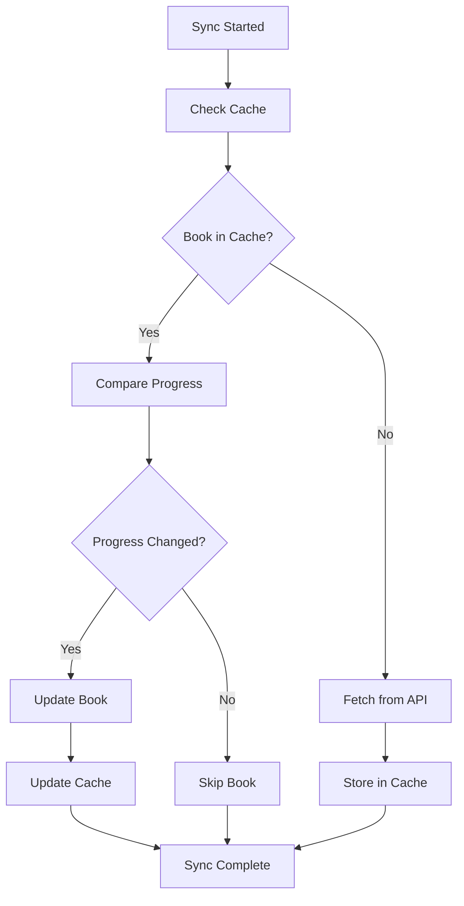

# 💾 Cache Management

ShelfBridge uses a simple SQLite-based cache system to optimize performance and reduce API calls. This guide explains how the cache works and how to manage it.

## 🎯 What is the Cache?

The cache stores:

- ✅ **Book metadata** from Audiobookshelf and Hardcover
- ✅ **Previous sync results** to detect changes
- ✅ **User library information** for faster lookups
- ✅ **Progress history** for regression protection

## 🔧 How the Cache Works

### Cache Benefits

```
Without Cache:
  - Every sync queries all books from APIs
  - Re-processes unchanged books
  - Slow performance (30-60 seconds)
  - Higher API usage

With Cache:
  - Only queries changed books
  - Skips unchanged books
  - Fast performance (2-5 seconds)
  - Minimal API usage
```

### Cache Lifecycle



## 📊 Cache Statistics

### Viewing Cache Stats

```bash
# Check cache statistics
docker exec -it shelfbridge node src/main.js cache --stats

# Node.js
node src/main.js cache --stats
```

**Sample output:**

```
=== Cache Statistics ===
Total books: 127
Recent books (last 7 days): 8
Cache size: 2.1 MB
```

### Cache Contents

```bash
# View detailed cache contents
docker exec -it shelfbridge node src/main.js cache --show

# Node.js
node src/main.js cache --show
```

**Note:** User-specific filtering (`--user`) and recent activity filtering (`--recent`) are not currently implemented.

## 🔧 Cache Management Commands

### Available Commands

```bash
# Show cache statistics
docker exec -it shelfbridge node src/main.js cache --stats

# Show detailed cache contents
docker exec -it shelfbridge node src/main.js cache --show

# Clear entire cache
docker exec -it shelfbridge node src/main.js cache --clear

# Export cache to JSON
docker exec -it shelfbridge node src/main.js cache --export backup.json
```

### Cache Export

The export functionality creates a JSON file containing all cached books:

```json
{
  "export_date": "2024-01-15T10:30:00.000Z",
  "total_books": 127,
  "books": [
    {
      "id": 1,
      "user_id": "alice",
      "identifier": "B08FHBV4ZX",
      "identifier_type": "asin",
      "title": "dune",
      "edition_id": 12345,
      "author": "Frank Herbert",
      "progress_percent": 45.2,
      "last_sync": "2024-01-15T09:15:00.000Z"
    }
  ]
}
```

## 📊 Cache Database Schema

### Current Implementation

```sql
-- Books table
CREATE TABLE books (
    id INTEGER PRIMARY KEY AUTOINCREMENT,
    user_id TEXT NOT NULL,
    identifier TEXT NOT NULL,
    identifier_type TEXT NOT NULL,
    title TEXT NOT NULL,
    edition_id INTEGER,
    author TEXT,
    progress_percent REAL DEFAULT 0.0,
    last_sync TIMESTAMP DEFAULT CURRENT_TIMESTAMP,
    updated_at TIMESTAMP DEFAULT CURRENT_TIMESTAMP,
    last_listened_at TIMESTAMP,
    started_at TIMESTAMP,
    finished_at TIMESTAMP,
    UNIQUE(user_id, identifier, title)
);

-- Sync tracking table
CREATE TABLE sync_tracking (
    user_id TEXT PRIMARY KEY,
    sync_count INTEGER DEFAULT 0,
    total_syncs INTEGER DEFAULT 0,
    created_at TIMESTAMP DEFAULT CURRENT_TIMESTAMP,
    updated_at TIMESTAMP DEFAULT CURRENT_TIMESTAMP
);

-- Library stats table
CREATE TABLE library_stats (
    user_id TEXT NOT NULL,
    total_books INTEGER,
    in_progress_books INTEGER,
    completed_books INTEGER,
    stats_date TIMESTAMP DEFAULT CURRENT_TIMESTAMP,
    PRIMARY KEY(user_id, stats_date)
);
```

### Cache File Locations

| Installation       | Cache Location                            |
| ------------------ | ----------------------------------------- |
| **Docker Compose** | `/app/data/.book_cache.db` (in container) |
| **Node.js**        | `data/.book_cache.db` (in project)        |
| **Manual Docker**  | Depends on volume mount                   |

## 🔍 Cache Troubleshooting

### Common Cache Issues

**Issue: Cache corruption**

```bash
# Symptoms
- "Database is locked" errors
- Sync failures
- SQLite errors

# Solutions
docker exec -it shelfbridge node src/main.js cache --clear
```

**Issue: Cache too large**

```bash
# Symptoms
- Disk space warnings
- Slow database operations

# Solutions
docker exec -it shelfbridge node src/main.js cache --clear
```

**Issue: No performance improvement**

```bash
# Symptoms
- Every sync takes the same amount of time
- No cache hits reported

# Check cache status
docker exec -it shelfbridge node src/main.js cache --stats
```

### Cache Debugging

```bash
# Check cache integrity
docker exec -it shelfbridge ls -la /app/data/.book_cache.db

# Check cache contents
docker exec -it shelfbridge node src/main.js cache --show

# Clear cache for fresh start
docker exec -it shelfbridge node src/main.js cache --clear
```

## 🌐 Multi-User Cache Management

### User Data Isolation

The cache automatically separates data by user ID:

- Each user's books are stored with their `user_id`
- Sync tracking is per-user
- Library stats are per-user
- Cache queries are automatically filtered by user

### Manual Cache Operations

**Note:** User-specific cache operations (like `--user alice`) are not currently implemented. All cache operations affect the entire cache for all users.

## 📈 Current Limitations

### Not Currently Implemented

The following features are **not implemented** but may be added in future versions:

**Configuration Options:**

- Cache expiration settings
- Maximum cache size limits
- Automatic cleanup schedules
- Performance tuning options

**Advanced Commands:**

- Import from JSON (`--import`)
- Cache health checks (`--health`)
- Database compaction (`--compact`)
- Cache validation (`--validate`)
- User-specific operations (`--user <userId>`)

**Performance Features:**

- Cache hit rate analysis
- Automatic optimization
- Size-based cleanup
- Performance monitoring

## 📈 Best Practices

### Recommended Usage

1. **Monitor cache size** periodically with `cache --stats`
2. **Export cache** before major changes with `cache --export`
3. **Clear cache** if you encounter sync issues
4. **Check cache contents** to verify data integrity

### When to Clear Cache

- **Troubleshooting**: If sync results seem inconsistent
- **Major config changes**: Changing user IDs or sync behavior
- **Fresh start**: Want to re-sync everything from scratch
- **Database errors**: If you see SQLite corruption warnings

### Backup Strategy

```bash
# Export cache before major changes
docker exec -it shelfbridge node src/main.js cache --export backup-$(date +%Y%m%d).json

# Keep cache database backup
docker exec -it shelfbridge cp /app/data/.book_cache.db /app/data/.book_cache.db.backup
```

## 🎯 Interactive Cache Management

You can also manage the cache through the interactive menu:

```bash
# Start interactive mode
docker exec -it shelfbridge node src/main.js interactive

# Select "Manage cache" from the menu
```

Available options:

- Show cache stats
- Show cache contents
- Clear cache
- Export cache to JSON

## 🎯 Next Steps

1. **[Configuration Reference](Configuration-Reference.md)** - Basic configuration options
2. **[Troubleshooting Guide](../troubleshooting/Troubleshooting-Guide.md)** - Solve sync issues
3. **[CLI Reference](../technical/CLI-Reference.md)** - All available commands

## 🆘 Need Help?

- **Configuration Help**: [Configuration Guide](Configuration-Guide.md)
- **General Questions**: [FAQ](../troubleshooting/FAQ.md)
- **Troubleshooting**: [Troubleshooting Guide](../troubleshooting/Troubleshooting-Guide.md)

---

**Simple cache management for reliable sync performance!** 💾⚡
