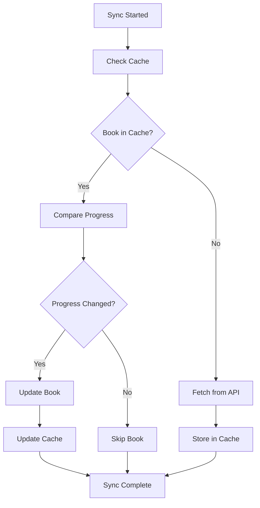

# 💾 Cache Management

ShelfBridge uses an intelligent SQLite-based cache system to optimize performance and reduce API calls. This guide explains how the cache works, how to manage it, and how to optimize it for your needs.

## 🎯 What is the Cache?

The cache stores:
- ✅ **Book metadata** from Audiobookshelf and Hardcover
- ✅ **Previous sync results** to detect changes
- ✅ **User library information** for faster lookups
- ✅ **Book matching results** to avoid re-matching
- ✅ **Progress history** for regression protection

## 🔧 How the Cache Works

### Cache Benefits

```
Without Cache:
  - Every sync queries all books from APIs
  - Re-processes unchanged books
  - Slow performance (30-60 seconds)
  - Higher API usage

With Cache:
  - Only queries changed books
  - Skips unchanged books
  - Fast performance (2-5 seconds)
  - Minimal API usage
```

### Cache Lifecycle



## 📊 Cache Statistics

### Viewing Cache Stats

```bash
# Check cache statistics
docker exec -it shelfbridge node src/main.js cache --stats

# Node.js
node src/main.js cache --stats
```

**Sample output:**
```
=== Cache Statistics ===
Database: /app/data/shelfbridge.db
Size: 2.1 MB
Total books: 127
Users: alice, bob
Recent books (last 7 days): 8
Cache hit rate: 92%
Last cleanup: 2024-01-15 03:15:00
```

### Cache Contents

```bash
# View detailed cache contents
docker exec -it shelfbridge node src/main.js cache --show

# Filter by user
docker exec -it shelfbridge node src/main.js cache --show --user alice

# Filter by recent activity
docker exec -it shelfbridge node src/main.js cache --show --recent
```

## 🛠️ Cache Configuration

### Basic Cache Settings

```yaml
global:
  # Cache configuration
  cache:
    # Enable caching (recommended)
    enabled: true
    
    # Cache expiration (hours)
    expiration: 168  # 1 week
    
    # Maximum cache size (MB)
    max_size: 100
    
    # Auto-cleanup frequency (hours)
    cleanup_frequency: 24
```

### Advanced Cache Configuration

```yaml
global:
  cache:
    # Enable caching
    enabled: true
    
    # Cache behavior
    expiration: 168              # 1 week
    max_size: 100               # 100 MB
    cleanup_frequency: 24       # Daily cleanup
    
    # Performance settings
    auto_compact: true          # Compact database periodically
    backup_before_cleanup: true # Backup before major operations
    
    # Cache validation
    validate_on_startup: true   # Check cache integrity
    repair_if_corrupted: true   # Auto-repair corruption
    
    # SQLite optimization
    sqlite_settings:
      journal_mode: "WAL"       # Write-Ahead Logging
      synchronous_mode: "NORMAL" # Balance safety/speed
      page_size: 4096          # 4KB pages
      cache_size: 2000         # 2000 pages in memory
      mmap_size: 64            # 64MB memory-mapped I/O
```

## 🔧 Cache Management Commands

### Cache Information

```bash
# Basic cache statistics
docker exec -it shelfbridge node src/main.js cache --stats

# Detailed cache information
docker exec -it shelfbridge node src/main.js cache --info

# Check cache health
docker exec -it shelfbridge node src/main.js cache --health
```

### Cache Maintenance

```bash
# Clear entire cache
docker exec -it shelfbridge node src/main.js cache --clear

# Clear cache for specific user
docker exec -it shelfbridge node src/main.js cache --clear --user alice

# Clear old entries
docker exec -it shelfbridge node src/main.js cache --cleanup

# Compact database
docker exec -it shelfbridge node src/main.js cache --compact
```

### Cache Backup and Restore

```bash
# Export cache to JSON
docker exec -it shelfbridge node src/main.js cache --export cache-backup.json

# Import cache from JSON
docker exec -it shelfbridge node src/main.js cache --import cache-backup.json

# Backup database file
docker exec -it shelfbridge cp /app/data/shelfbridge.db /app/data/shelfbridge.db.backup
```

## 📈 Cache Performance Optimization

### Performance Monitoring

```bash
# Check cache performance
docker exec -it shelfbridge node src/main.js cache --stats --verbose

# Monitor cache hit rate
docker exec -it shelfbridge node src/main.js sync --dry-run | grep -i cache
```

### Cache Hit Rate Analysis

```
Cache Hit Rate Analysis:
==================================================
Total Books: 127
Cache Hits: 117 (92%)
Cache Misses: 10 (8%)
New Books: 3
Changed Books: 7
==================================================
```

**Good cache hit rates:**
- 90%+ for regular usage
- 80%+ for new setups
- 70%+ for frequently changing libraries

### Optimization Strategies

```yaml
# For large libraries (1000+ books)
global:
  cache:
    max_size: 500              # Increase cache size
    cleanup_frequency: 168     # Weekly cleanup
    sqlite_settings:
      cache_size: 5000         # More memory
      mmap_size: 128           # Larger memory mapping

# For frequent syncs
global:
  cache:
    expiration: 720            # 30 days
    auto_compact: true
    
# For limited resources
global:
  cache:
    max_size: 50               # Smaller cache
    cleanup_frequency: 12      # More frequent cleanup
```

## 🔍 Cache Troubleshooting

### Common Cache Issues

**Issue: Cache corruption**
```bash
# Symptoms
- "Database is locked" errors
- Sync failures
- Corrupted data warnings

# Solutions
docker exec -it shelfbridge node src/main.js cache --repair
docker exec -it shelfbridge node src/main.js cache --clear
```

**Issue: Poor performance**
```bash
# Symptoms
- Slow sync times
- High CPU usage
- Low cache hit rates

# Solutions
docker exec -it shelfbridge node src/main.js cache --compact
docker exec -it shelfbridge node src/main.js cache --cleanup
```

**Issue: Cache too large**
```bash
# Symptoms
- Disk space warnings
- Memory issues
- Slow database operations

# Solutions
docker exec -it shelfbridge node src/main.js cache --cleanup
# Edit config: reduce max_size
```

### Cache Debugging

```bash
# Check cache integrity
docker exec -it shelfbridge node src/main.js cache --validate

# Debug cache operations
docker exec -it shelfbridge node src/main.js sync --dry-run --verbose | grep -i cache

# Check database file
docker exec -it shelfbridge ls -la /app/data/shelfbridge.db
```

## 🔄 Cache Lifecycle Management

### Automatic Cleanup

```yaml
global:
  cache:
    # Automatic cleanup settings
    cleanup_frequency: 24       # Hours between cleanup
    expiration: 168            # Hours before entries expire
    max_size: 100              # MB before forced cleanup
    
    # Cleanup criteria
    cleanup_rules:
      remove_expired: true     # Remove expired entries
      remove_unused: true      # Remove unused entries
      remove_errors: true      # Remove error entries
      compact_after: true      # Compact after cleanup
```

### Manual Cleanup

```bash
# Remove expired entries
docker exec -it shelfbridge node src/main.js cache --cleanup --expired

# Remove unused entries
docker exec -it shelfbridge node src/main.js cache --cleanup --unused

# Remove error entries
docker exec -it shelfbridge node src/main.js cache --cleanup --errors

# Full cleanup
docker exec -it shelfbridge node src/main.js cache --cleanup --all
```

## 🎯 Cache Strategies

### Conservative Caching

```yaml
global:
  cache:
    enabled: true
    expiration: 72             # 3 days
    max_size: 50               # Conservative size
    cleanup_frequency: 12      # Frequent cleanup
    auto_compact: true
```

**Use case**: Frequently changing libraries, limited resources

### Aggressive Caching

```yaml
global:
  cache:
    enabled: true
    expiration: 720            # 30 days
    max_size: 500              # Large cache
    cleanup_frequency: 168     # Weekly cleanup
    auto_compact: false
```

**Use case**: Stable libraries, performance-focused

### Balanced Caching

```yaml
global:
  cache:
    enabled: true
    expiration: 168            # 1 week
    max_size: 100              # Reasonable size
    cleanup_frequency: 24      # Daily cleanup
    auto_compact: true
```

**Use case**: Most users (recommended)

## 🌐 Multi-User Cache Management

### User-Specific Cache

```yaml
# Cache is automatically separated by user
User Data Isolation:
  - alice: Books and progress for Alice
  - bob: Books and progress for Bob
  - charlie: Books and progress for Charlie
```

### User Cache Operations

```bash
# Check cache for specific user
docker exec -it shelfbridge node src/main.js cache --stats --user alice

# Clear cache for specific user
docker exec -it shelfbridge node src/main.js cache --clear --user alice

# Export user-specific cache
docker exec -it shelfbridge node src/main.js cache --export alice-cache.json --user alice
```

## 📊 Cache Database Schema

### Understanding the Database

```sql
-- Books table
CREATE TABLE books (
    id INTEGER PRIMARY KEY AUTOINCREMENT,
    user_id TEXT NOT NULL,
    identifier TEXT NOT NULL,
    identifier_type TEXT NOT NULL,
    title TEXT NOT NULL,
    author TEXT,
    progress_percent REAL DEFAULT 0.0,
    last_sync TIMESTAMP DEFAULT CURRENT_TIMESTAMP,
    created_at TIMESTAMP DEFAULT CURRENT_TIMESTAMP,
    updated_at TIMESTAMP DEFAULT CURRENT_TIMESTAMP
);

-- Indexes for performance
CREATE INDEX idx_books_user_id ON books(user_id);
CREATE INDEX idx_books_identifier ON books(identifier);
CREATE INDEX idx_books_last_sync ON books(last_sync);
```

### Cache File Locations

| Installation | Cache Location |
|--------------|----------------|
| **Docker Compose** | `/app/data/shelfbridge.db` (in container) |
| **Node.js** | `data/shelfbridge.db` (in project) |
| **Manual Docker** | Depends on volume mount |

## 🛡️ Cache Security

### Backup Strategies

```bash
# Regular backup
docker exec -it shelfbridge node src/main.js cache --export daily-backup.json

# Automated backup script
#!/bin/bash
DATE=$(date +%Y%m%d_%H%M%S)
docker exec -it shelfbridge node src/main.js cache --export "backup_${DATE}.json"
```

### Cache Encryption

```yaml
# For sensitive environments
global:
  cache:
    enabled: true
    encrypt_cache: true        # Encrypt cache database
    encryption_key: "your-secret-key"
    
    # Secure deletion
    secure_delete: true
    overwrite_deleted: true
```

## 🔄 Cache Migration

### Upgrading Cache Schema

```bash
# Check cache version
docker exec -it shelfbridge node src/main.js cache --version

# Migrate cache schema
docker exec -it shelfbridge node src/main.js cache --migrate

# Backup before migration
docker exec -it shelfbridge node src/main.js cache --export pre-migration-backup.json
```

### Moving Cache Between Installations

```bash
# Export from old installation
old-installation$ node src/main.js cache --export migration.json

# Import to new installation
new-installation$ node src/main.js cache --import migration.json
```

## 📈 Best Practices

### Recommended Settings

**For most users:**
```yaml
global:
  cache:
    enabled: true
    expiration: 168
    max_size: 100
    cleanup_frequency: 24
    auto_compact: true
```

**For large libraries:**
```yaml
global:
  cache:
    enabled: true
    expiration: 336            # 2 weeks
    max_size: 500
    cleanup_frequency: 168     # Weekly
    auto_compact: false
```

**For resource-constrained systems:**
```yaml
global:
  cache:
    enabled: true
    expiration: 72             # 3 days
    max_size: 25
    cleanup_frequency: 12      # Twice daily
    auto_compact: true
```

### Monitoring and Maintenance

1. **Monitor cache hit rates** regularly
2. **Check cache size** periodically
3. **Backup cache** before major changes
4. **Clean up expired entries** regularly
5. **Compact database** monthly

## 🎯 Next Steps

1. **[Advanced Configuration](Advanced-Configuration.md)** - Fine-tune cache settings
2. **[Performance Issues](../troubleshooting/Performance-Issues.md)** - Optimize slow syncs
3. **[Troubleshooting Guide](../troubleshooting/Troubleshooting-Guide.md)** - Solve cache issues

## 🆘 Need Help?

- **Cache Issues**: [Performance Issues](../troubleshooting/Performance-Issues.md)
- **Configuration Help**: [Configuration Overview](Configuration-Overview.md)
- **General Questions**: [FAQ](../troubleshooting/FAQ.md)

---

**Efficient cache management keeps ShelfBridge running smoothly!** 💾⚡ 