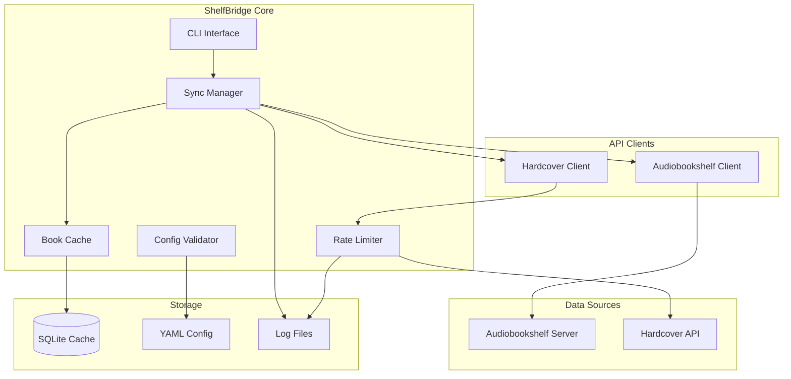
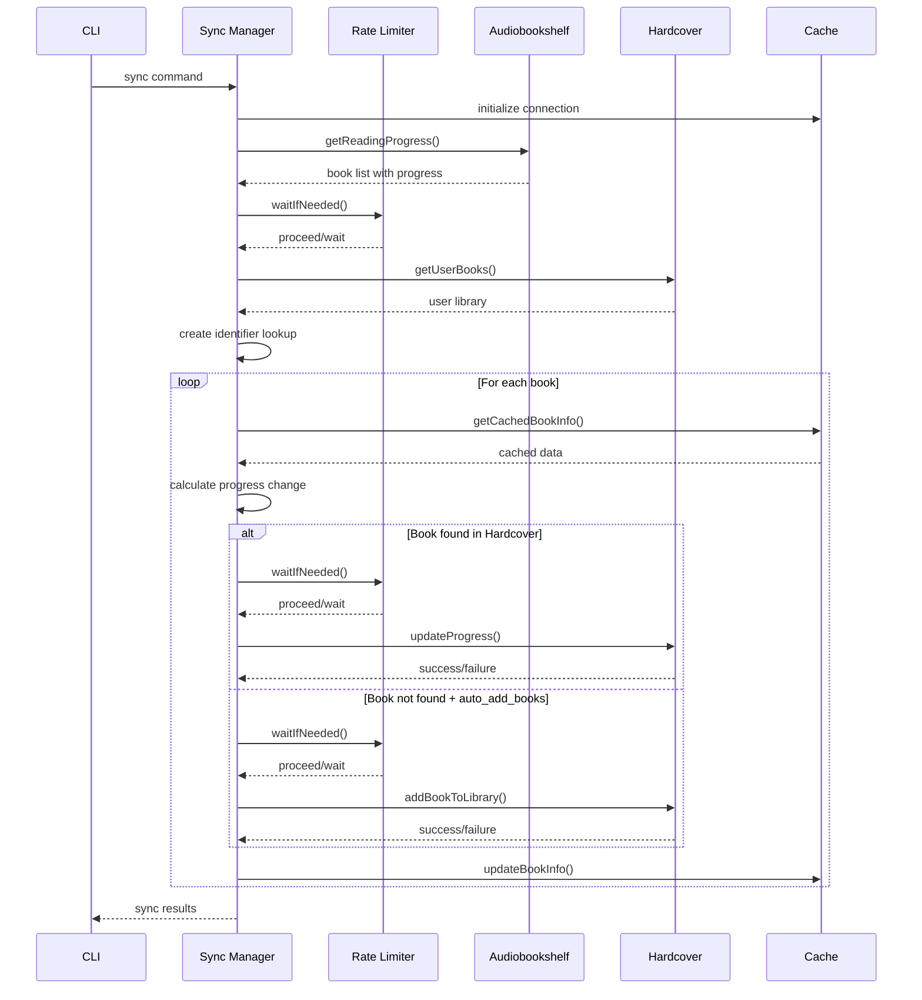
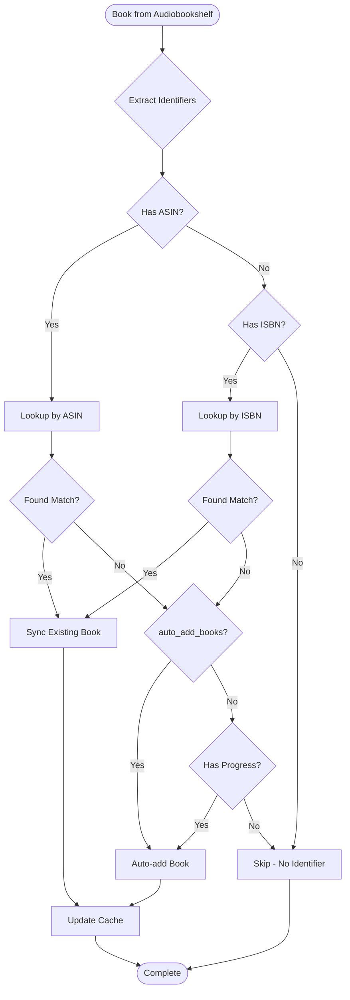

# 🏗️ Architecture Overview

This document explains how ShelfBridge works internally, its components, data flow, and technical decisions. It's intended for developers, contributors, and technically-minded users.

## 🎯 High-Level Architecture

ShelfBridge is a Node.js application that acts as a bridge between two services:



## 📦 Core Components

### 1. Main CLI (`src/main.js`)

**Purpose**: Command-line interface and application entry point

**Responsibilities**:
- Parse command-line arguments using Commander.js
- Validate configuration on startup
- Route commands to appropriate handlers
- Manage application lifecycle

**Key Features**:
- Multiple command support (sync, debug, cache, validate)
- Global options (--dry-run, --skip-validation)
- Error handling and exit codes
- Background service scheduling

### 2. Sync Manager (`src/sync-manager.js`)

**Purpose**: Core synchronization logic and orchestration

**Responsibilities**:
- Coordinate data flow between Audiobookshelf and Hardcover
- Implement book matching algorithm
- Handle progress calculation and conversion
- Manage re-reading detection and progress regression protection
- Cache integration and optimization

**Key Algorithms**:
```javascript
// High-level sync flow
async syncProgress() {
    1. Fetch books from Audiobookshelf
    2. Fetch user library from Hardcover
    3. Create identifier lookup table
    4. For each Audiobookshelf book:
        a. Extract identifiers (ASIN/ISBN)
        b. Check cache for existing data
        c. Calculate current progress
        d. Find match in Hardcover library
        e. Decide sync action (update/auto-add/skip)
        f. Execute sync operation
        g. Update cache
    5. Return comprehensive results
}
```

### 3. API Clients

#### Audiobookshelf Client (`src/audiobookshelf-client.js`)

**Purpose**: Interface with Audiobookshelf REST API

**Features**:
- JWT token authentication
- Rate limiting (10 requests/second)
- Parallel request processing
- Automatic retry logic
- Progress data extraction

**Key Methods**:
```javascript
getReadingProgress()     // Fetch user's reading progress
getUserInfo()           // Get user details
testConnection()        // Verify API access
```

#### Hardcover Client (`src/hardcover-client.js`)

**Purpose**: Interface with Hardcover GraphQL API

**Features**:
- GraphQL query execution
- Mutation operations for progress updates
- Pagination handling for large libraries
- Schema introspection capabilities
- **Rate limiting**: 55 requests/minute with intelligent queuing

**Key Operations**:
```javascript
getUserBooks()          // Fetch user's library
updateProgress()        // Update reading progress
markCompleted()         // Mark book as finished
addBookToLibrary()      // Auto-add new books
```

**Rate Limiting Architecture**:
```javascript
// Uses rate-limiter-flexible library
const rateLimiter = new RateLimiter(55); // 55 requests/minute total

async _executeQuery(query, variables) {
    await this.rateLimiter.waitIfNeeded('hardcover-api');  // Single identifier for all requests
    return await this.graphqlRequest(query, variables);
}
```

### 4. Book Cache (`src/book-cache.js`)

**Purpose**: SQLite-based caching system for performance optimization

**Database Schema**:
```sql
CREATE TABLE books (
    id INTEGER PRIMARY KEY AUTOINCREMENT,
    user_id TEXT NOT NULL,
    identifier TEXT NOT NULL,           -- ISBN or ASIN
    identifier_type TEXT NOT NULL,      -- 'isbn' or 'asin'
    title TEXT NOT NULL,
    edition_id INTEGER,                 -- Hardcover edition ID
    author TEXT,
    last_progress REAL DEFAULT 0.0,     -- Previous progress %
    progress_percent REAL DEFAULT 0.0,  -- Current progress %
    last_sync TIMESTAMP DEFAULT CURRENT_TIMESTAMP,
    updated_at TIMESTAMP DEFAULT CURRENT_TIMESTAMP,
    last_listened_at TIMESTAMP,
    started_at TIMESTAMP,
    finished_at TIMESTAMP,
    UNIQUE(user_id, identifier, title)
);
```

**Cache Benefits**:
- **Performance**: Only sync changed progress
- **Persistence**: Survives application restarts
- **Multi-user**: Isolated data per user
- **Migration**: Automatic schema updates

### 5. Rate Limiting System (`src/utils.js`)

**Purpose**: Intelligent API rate limiting to prevent exceeding service limits

**Implementation**:
```javascript
class RateLimiter {
    constructor(maxRequestsPerMinute = 55) {
        this.rateLimiter = new RateLimiterMemory({
            points: maxRequestsPerMinute,
            duration: 60,  // per 60 seconds
        });
    }
    
    async waitIfNeeded(identifier = 'default') {
        // Queue request if rate limit would be exceeded
        await this.rateLimiter.consume(identifier);
    }
}
```

**Features**:
- **Intelligent queuing**: Requests are delayed, not dropped
- **Per-service limits**: Different limits for different APIs
- **Warning system**: Logs warnings at 80% capacity
- **Multi-identifier support**: Separate limits for different request types

**Rate Limits**:
- **Hardcover API**: 55 requests/minute (respects their published limits)
- **Audiobookshelf**: 10 requests/second (more lenient for local servers)

**Impact on Sync Performance**:
- **Small libraries** (< 50 books): No noticeable impact
- **Large libraries** (100+ books): May extend sync time to 2-5 minutes
- **Automatic handling**: No user intervention required

### 6. Configuration System (`src/config.js`, `src/config-validator.js`)

**Purpose**: YAML-based configuration with comprehensive validation

**Validation Features**:
- Syntax validation (YAML structure)
- Type checking (string, number, boolean)
- Range validation (e.g., 0-100 for percentages)
- Custom validators (URLs, cron schedules, timezones)
- Placeholder detection
- API connection testing

## 🔄 Data Flow

### Sync Process Flow



### Book Matching Algorithm



## 🧠 Key Algorithms

### Progress Regression Protection

**Purpose**: Prevent accidental overwrites when re-reading books

**Algorithm**:
```javascript
determineProgressAction(currentProgress, cachedProgress, isCompleted) {
    if (isCompleted && currentProgress < HIGH_PROGRESS_THRESHOLD) {
        return 'NEW_SESSION'; // Re-reading completed book
    }
    
    if (cachedProgress >= HIGH_PROGRESS_THRESHOLD) {
        const drop = cachedProgress - currentProgress;
        if (drop > REGRESSION_BLOCK_THRESHOLD) {
            return 'BLOCK'; // Block large drops
        } else if (drop > REGRESSION_WARN_THRESHOLD) {
            return 'WARN'; // Warn about moderate drops
        }
    }
    
    return 'UPDATE'; // Normal update
}
```

### Progress Calculation

**Audiobooks** (time-based):
```javascript
calculateAudiobookProgress(progressSeconds, totalSeconds) {
    return Math.min((progressSeconds / totalSeconds) * 100, 100);
}
```

**Books** (page-based):
```javascript
calculateBookProgress(currentPage, totalPages) {
    return Math.min((currentPage / totalPages) * 100, 100);
}
```

### Identifier Extraction

**Priority Order**:
1. **ASIN** (Amazon Standard Identification Number) - preferred for audiobooks
2. **ISBN-13** - modern book standard
3. **ISBN-10** - legacy book standard

**Extraction Logic**:
```javascript
extractIdentifiers(bookData) {
    // Search multiple possible locations in book metadata
    const searchPaths = [
        'asin', 'media.asin', 'media.metadata.asin',
        'isbn', 'isbn_13', 'isbn_10',
        'media.isbn', 'media.metadata.isbn'
    ];
    
    return {
        asin: normalizeAsin(findInPaths(bookData, asinPaths)),
        isbn: normalizeIsbn(findInPaths(bookData, isbnPaths))
    };
}
```

## 🔧 Technical Decisions

### Why SQLite for Caching?

**Pros**:
- **Zero-configuration**: No separate database server required
- **ACID compliance**: Reliable data integrity
- **Cross-platform**: Works on all supported platforms
- **Lightweight**: Minimal resource usage
- **SQL interface**: Easy querying and debugging

**Cons**:
- **Single-writer**: Not suitable for high-concurrency (not needed here)
- **Size limits**: Not relevant for our use case

### Why GraphQL for Hardcover?

**Hardcover provides a GraphQL API**, so this wasn't a choice but a requirement. Benefits:
- **Precise data fetching**: Request only needed fields
- **Type safety**: Schema-defined operations
- **Introspection**: Self-documenting API
- **Single endpoint**: Simpler URL management

### Why REST for Audiobookshelf?

**Audiobookshelf provides a REST API**. Characteristics:
- **Simple authentication**: JWT token in header
- **Predictable URLs**: Standard REST patterns
- **JSON responses**: Easy to parse
- **Rate limiting**: 10 requests/second

### Parallel Processing Design

**Implementation**:
```javascript
// Process books in batches with worker limit
async function processBooks(books, workers = 3) {
    const queue = [...books];
    const results = [];
    const workers = Array(workerCount).fill().map(() => 
        processWorker(queue, results)
    );
    
    await Promise.all(workers);
    return results;
}
```

**Benefits**:
- **Performance**: Faster sync times
- **Rate limiting**: Respects API limits
- **Resource control**: Configurable worker count

## 📊 Performance Characteristics

### Cache Performance

**First Sync** (no cache):
- Duration: ~30-60 seconds for 100 books
- API calls: ~200-300 requests
- Database writes: 100 book records

**Subsequent Syncs** (with cache):
- Duration: ~5-10 seconds for 100 books
- API calls: ~20-50 requests (only changed books)
- Database updates: 5-10 records typically

**Rate Limiting Impact**:
- **Small libraries** (< 50 books): Minimal impact (~5-15 seconds)
- **Large libraries** (100+ books): May extend to 2-5 minutes
- **Initial syncs**: Higher impact due to more API calls
- **Automatic handling**: No manual intervention required

### Memory Usage

**Typical Memory Footprint**:
- **Base application**: ~30-50 MB
- **Book metadata cache**: ~1-2 MB per 1000 books
- **API response buffers**: ~5-10 MB during sync

### Network Usage

**API Calls per Sync**:
- **Audiobookshelf**: 1-2 requests (bulk progress fetch)
- **Hardcover**: 
  - Library fetch: 1-5 requests (paginated)
  - Updates: 1 request per changed book
  - Total: typically 10-50 requests

**Rate Limiting Considerations**:
- **Hardcover limit**: 55 requests/minute maximum
- **Request queuing**: Automatic delay when approaching limits
- **Burst handling**: Initial requests may queue more than steady-state
- **Logging**: Warns at 80% capacity (44+ requests/minute)

## 🛡️ Error Handling Strategy

### Graceful Degradation

**API Failures**:
- Continue with other books if one fails
- Comprehensive error reporting
- Cache preserves previous state

**Network Issues**:
- Automatic retry with exponential backoff
- Timeout handling (30 seconds)
- Connection pooling for efficiency

**Data Integrity**:
- Transaction-based cache updates
- Validation before API calls
- Rollback on critical failures

## 🔗 Related Pages

- **[Book Caching System](Book-Caching-System.md)** - Detailed cache implementation
- **[Audiobookshelf API](Audiobookshelf-API.md)** - API integration details
- **[Hardcover API](Hardcover-API.md)** - GraphQL integration
- **[Sync Algorithm](../developer/Sync-Algorithm.md)** - Developer deep-dive

## 🎯 Future Architecture Considerations

### Scalability
- **Database**: SQLite handles thousands of books efficiently
- **Memory**: Streaming for very large libraries
- **Network**: Batch operations for better performance

### Extensibility
- **Plugin system**: For additional book services
- **Configuration**: Environment variable support
- **Monitoring**: Health check endpoints
- **API**: Potential REST API for external integration

---

**For Developers**: See [Code Structure](../developer/Code-Structure.md) for implementation details and [Contributing Guide](../developer/Contributing.md) for development workflow. 