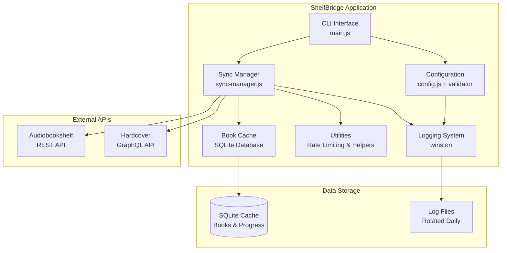
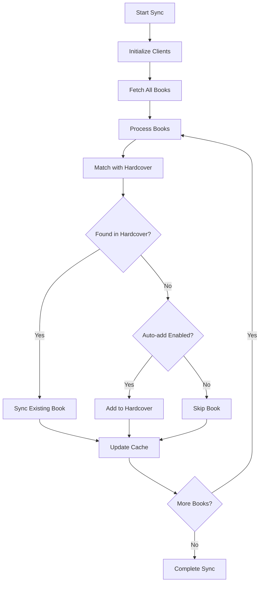

# 🏗️ Architecture Overview

## System Overview

ShelfBridge is a Node.js application that synchronizes audiobook reading progress between Audiobookshelf (audiobook server) and Hardcover (social reading platform). The application follows a modular architecture with clear separation of concerns and robust error handling.



## Core Components

### 1. **Entry Point (main.js)**

- **Purpose**: CLI interface and application bootstrap
- **Features**: 11 commands, interactive mode, process management
- **Commands**:
  - `sync` - Main synchronization functionality
  - `test` - API connection testing
  - `validate` - Configuration validation
  - `config` - Show current configuration
  - `cache` - Cache management operations
  - `cron` - Scheduled background sync
  - `interactive` - Menu-driven interface
  - `debug` - Comprehensive debugging information
  - `schema` - GraphQL schema exploration
  - `start` - Default scheduled sync mode

### 2. **Configuration System**

#### config.js

- **Purpose**: YAML configuration loading and management
- **Features**: Default value application, explicit value tracking
- **Structure**: Global settings + user-specific configurations

#### config-validator.js

- **Purpose**: Comprehensive configuration validation
- **Features**:
  - Schema-based validation for 25+ configuration options
  - Placeholder value detection
  - API connection testing
  - User-friendly error messages
  - Configuration help generation

### 3. **API Client Layer**

#### audiobookshelf-client.js

- **Purpose**: REST API integration with Audiobookshelf
- **Features**:
  - HTTP connection pooling with keep-alive
  - Rate limiting (default: 600 requests/minute)
  - Comprehensive progress fetching
  - Pagination support
  - Comprehensive error handling

#### hardcover-client.js

- **Purpose**: GraphQL API integration with Hardcover
- **Features**:
  - GraphQL query/mutation execution
  - Book searching by ISBN/ASIN
  - Progress updates and completion marking
  - Schema introspection capabilities
  - Connection pooling and rate limiting (default: 55 requests/minute)

### 4. **Data Persistence (book-cache.js)**

- **Purpose**: SQLite-based caching system
- **Features**:
  - WAL mode for better concurrency
  - Multi-table schema (books, sync tracking, library stats)
  - Database migrations
  - Performance optimizations with indexes
  - Cache statistics and management
  - JSON export functionality

#### Database Schema

```sql
-- Books table - stores cached book information
books (
  id INTEGER PRIMARY KEY,
  user_id TEXT NOT NULL,
  identifier TEXT NOT NULL,      -- ISBN or ASIN
  identifier_type TEXT NOT NULL, -- 'isbn' or 'asin'
  title TEXT NOT NULL,
  edition_id INTEGER,
  author TEXT,
  progress_percent REAL,
  last_sync TIMESTAMP,
  updated_at TIMESTAMP,
  last_listened_at TIMESTAMP,
  started_at TIMESTAMP,
  finished_at TIMESTAMP,
  UNIQUE(user_id, identifier, title)
);

-- Sync tracking table - tracks sync frequency
sync_tracking (
  user_id TEXT PRIMARY KEY,
  sync_count INTEGER,
  total_syncs INTEGER,
  created_at TIMESTAMP,
  updated_at TIMESTAMP
);

-- Library stats table - caches library statistics
library_stats (
  user_id TEXT PRIMARY KEY,
  total_books INTEGER,
  books_with_progress INTEGER,
  in_progress_books INTEGER,
  completed_books INTEGER,
  never_started_books INTEGER,
  last_updated TIMESTAMP
);
```

### 5. **Synchronization Engine (sync-manager.js)**

- **Purpose**: Core business logic for progress synchronization
- **Architecture**: Class-based with dependency injection
- **Key Features**:
  - Progress regression protection
  - Re-reading detection
  - Auto-add functionality
  - Parallel/sequential processing modes
  - Comprehensive result tracking

#### Sync Flow



### 6. **Utility Layer (utils.js)**

- **Purpose**: Shared functionality and helpers
- **Components**:
  - **Semaphore**: Concurrency control
  - **RateLimiter**: API rate limiting using rate-limiter-flexible
  - **ISBN/ASIN Normalization**: Book identifier standardization
  - **Enhanced Author Extraction**: Hierarchical data processing with multi-author support
  - **Narrator Detection**: Role-based extraction with explicit label support
  - **Text Similarity**: Target-based matching for collaborative works
  - **Data Extraction**: Book metadata parsing with contributions support
  - **Connection Testing**: Shared API validation

### 7. **Logging System (logger.js)**

- **Purpose**: Structured logging with Winston
- **Features**:
  - Daily log rotation
  - Multiple log levels (error, warn, info, debug)
  - Structured JSON logging
  - Context-aware logging (user, operation, book)
  - Performance measurement helpers
  - Separate error and exception handling

## Data Flow

### 1. **Configuration Loading**

```
config.yaml → Config.js → ConfigValidator.js → Validated Configuration
```

### 2. **Sync Process**

```
User Command → SyncManager → AudiobookshelfClient → Book Data
                ↓
Book Data → Book Matching → HardcoverClient → Progress Update
                ↓
Progress Update → BookCache → SQLite Database
```

### 3. **Caching Strategy**

```
Every Sync: Fetch All Books → Update Cache → Store Fresh Library Stats
```

## Performance Optimizations

### 1. **Connection Management**

- HTTP keep-alive connections
- Connection pooling for both APIs
- Proper connection cleanup on exit

### 2. **Concurrency Control**

- Semaphore-based request limiting
- Configurable parallel processing
- Rate limiting to respect API limits

### 3. **Caching Strategy**

- SQLite WAL mode for concurrent access
- Indexes on frequently queried columns
- Library statistics caching

### 4. **Memory Management**

- Streaming JSON parsing for large responses
- Cleanup handlers for graceful shutdown
- Resource cleanup in sync manager

## Security Considerations

### 1. **API Token Handling**

- Tokens normalized to remove Bearer prefixes
- No token logging in production
- Secure token validation

### 2. **Error Handling**

- Comprehensive error catching
- Sensitive data filtering in logs
- Graceful degradation on API failures

### 3. **Input Validation**

- Schema-based configuration validation
- URL and data sanitization
- Placeholder value detection

## Extensibility Points

### 1. **Configuration System**

- New validation rules in ConfigValidator
- Additional configuration sections
- Custom validation functions

### 2. **API Clients**

- Plugin architecture potential
- Additional API integrations
- Custom matching algorithms

### 3. **Sync Logic**

- Custom sync strategies
- Additional book metadata sources
- Progress calculation customization

## Dependencies

### Core Dependencies

- **axios**: HTTP client for API calls
- **better-sqlite3**: SQLite database driver
- **winston**: Logging framework
- **js-yaml**: YAML configuration parsing
- **commander**: CLI framework
- **luxon**: Date/time handling
- **inquirer**: Interactive prompts

### Performance Dependencies

- **rate-limiter-flexible**: API rate limiting
- **node-cron**: Scheduled execution
- **cronstrue**: Human-readable cron expressions

This architecture provides a robust, scalable foundation for synchronizing reading progress between different platforms while maintaining data integrity and providing excellent user experience through comprehensive CLI tooling.
