# GitHub Workflows

This page documents all automated workflows that run on the ShelfBridge repository to ensure code quality, security, and reliable deployments.

## 📋 Overview

ShelfBridge uses **6 GitHub Actions workflows** to automate:

- **Code Quality** - ESLint, security checks, dependency audits
- **Testing** - Cross-platform Node.js testing
- **Security** - Secret scanning, vulnerability detection
- **Releases** - Automated version tagging and changelog generation
- **Docker Build** - Container image building, testing, and publishing (consolidated)
- **Docker Test** - Comprehensive container testing including PR support

## 🔄 Workflow Summary

| Workflow                                  | Trigger                                   | Purpose                      | Status    |
| ----------------------------------------- | ----------------------------------------- | ---------------------------- | --------- |
| [CI Pipeline](#ci-pipeline)               | Push/PR to main                           | Test across Node.js versions | ✅ Active |
| [Code Quality](#code-quality)             | Push/PR to main                           | ESLint + security scans      | ✅ Active |
| [Release Automation](#release-automation) | Conventional commits to main              | Release Please automation    | ✅ Active |
| [Docker Build](#docker-build)             | Main, feature branches (14 patterns), PRs | Build, test, and publish     | ✅ Active |
| [Docker Test](#docker-test)               | After Docker Build (14 patterns), PRs     | Comprehensive testing        | ✅ Active |

| [Security Scan](#security-scan) | Push/PR, weekly schedule | Security auditing | ✅ Active |
| [Pull Request Labeler](#pull-request-labeler) | Pull requests to main | Automatic PR labeling | ✅ Active |

---

## 🧪 CI Pipeline

**File:** `.github/workflows/ci.yml`  
**Purpose:** Ensure code works across multiple Node.js versions

### 🔧 Critical Bug Fix: Main Entry Point Test

**Fixed Issue:** The main entry point test was using malformed command syntax that gave false positives

**Previous Problem:**

```bash
# BROKEN - This didn't actually test the application:
node -e "console.log('✅ Main entry point loads successfully')" src/main.js --help
```

**Solution Applied:**

```bash
# CORRECT - Actually tests if the app's --help command works:
node src/main.js --help >/dev/null 2>&1
```

**Benefits:**

- ✅ Actually validates application functionality across Node.js versions
- ✅ Catches real entry point failures instead of false positives
- ✅ Proper error handling and clean output
- ✅ Ensures CI reliability for critical application testing

### Triggers

- Push to `main` branch
- Pull requests targeting `main`

### What It Does

1. **Multi-version Testing** - Tests on Node.js 18.x, 20.x, 21.x
2. **Dependency Installation** - Runs `npm ci` with caching
3. **Application Testing** - Executes `npm test` with timeout
4. **Configuration Validation** - Runs `npm run config`
5. **Cache Testing** - Tests cache functionality
6. **Entry Point Verification** - Validates main application loads
7. **File Structure Check** - Ensures required files exist

### Matrix Strategy

```yaml
strategy:
  matrix:
    node-version: [20.x, 22.x] # Updated: Node.js 20+ required by dependencies
```

### 🔧 Node.js Version Update

**Updated:** CI matrix to align with dependency requirements

**Previous Configuration:**

```yaml
node-version: [18.x, 20.x, 21.x] # Node.js 18 causing EBADENGINE warnings
```

**Current Configuration:**

```yaml
node-version: [20.x, 22.x] # Supports current LTS (20) and latest stable (22)
```

**Reason for Change:**

- **better-sqlite3@12.2.0** requires Node.js 20+
- **lint-staged@16.1.2** requires Node.js 20.17+
- **commander@14.0.0** requires Node.js 20+
- **Node.js 18 EOL:** April 2025 (packages dropping support)

**Benefits:**

- ✅ **No more EBADENGINE warnings** during npm install
- ✅ **Future compatibility** with updated dependencies
- ✅ **LTS alignment** with current Node.js support lifecycle

### Success Criteria

- ✅ All Node.js versions pass
- ✅ Configuration validates successfully
- ✅ Cache system functions correctly
- ✅ Application starts without errors

---

## 🔍 Code Quality

**File:** `.github/workflows/code-quality.yml`  
**Purpose:** Enforce coding standards and detect quality issues

### 🔧 Performance Fix: Dependency Management

**Fixed Issue:** The workflow was installing ESLint dependencies during runtime instead of using package.json versions

**Previous Problem:**

```yaml
# REDUNDANT - Installing dependencies already in package.json:
- name: Install ESLint
  run: npm install --save-dev eslint@latest @eslint/js globals
```

**Issues with Runtime Installation:**

- ❌ **Version drift** - CI uses `@latest`, development uses package.json versions
- ❌ **Inconsistent behavior** - different ESLint versions between environments
- ❌ **Slower builds** - unnecessary package downloads during CI
- ❌ **Risk of breaks** - unexpected breaking changes from latest versions

**Solution Applied:**

```yaml
# EFFICIENT - Use dependencies already installed by npm ci:
- name: Install dependencies
  run: npm ci

- name: Run ESLint # Uses exact versions from package.json
  run: npx eslint src/ --ext .js --max-warnings 0
```

**Benefits:**

- ✅ **Consistent versions** - same ESLint version across all environments
- ✅ **Faster CI builds** - no redundant package installations
- ✅ **Predictable behavior** - eliminates version-related surprises
- ✅ **Better dependency management** - single source of truth in package.json

### Triggers

- Push to `main` branch
- Pull requests targeting `main`

### Jobs

#### `lint` Job

1. **ESLint Analysis** - Enforces JavaScript coding standards
2. **Debug Statement Detection** - Finds `console.debug`, `debugger` statements
3. **TODO Comment Tracking** - Reports TODO/FIXME comments
4. **Dependency Security Audit** - Scans for high-severity vulnerabilities (legacy check)
5. **Package.json Validation** - Verifies required npm scripts exist
6. **Configuration File Validation** - Validates YAML syntax

#### `security-scan` Job (NEW)

1. **Dependency Security Audit** - npm audit for high-severity vulnerabilities
2. **Hardcoded Secret Detection** - Scans for potential hardcoded credentials
3. **Required Status Check** - Provides `security-scan` status for branch protection

### ESLint Configuration

- **Smart Console Rules** - Allows CLI output, blocks debug statements
- **Unused Variable Detection** - Prevents dead code
- **Security Rules** - Blocks `eval`, dangerous patterns
- **CLI-Friendly** - Configured for command-line tools

### Quality Gates

#### `lint` Job

- ❌ **Fails on:** ESLint errors, invalid configuration files
- ⚠️ **Warns on:** TODO comments, debug statements

#### `security-scan` Job

- ❌ **Fails on:** High-severity vulnerabilities, obvious hardcoded secrets
- ⚠️ **Reports:** Potential security concerns for review

---

## 🚀 Release Automation

**File:** `.github/workflows/version-and-release.yml`  
**Purpose:** Industry-standard automated releases using Google's Release Please

### What is Release Please?

**Release Please** is Google's battle-tested automation tool that handles releases while respecting branch protection rules. Used by Google, Angular, Firebase, and thousands of open-source projects.

### How It Works

#### **Phase 1: Release PR Creation**

- **Trigger:** Push to `main` branch with conventional commits
- **Action:** Creates/updates a Release PR with version bump and changelog
- **Respects:** Branch protection rules (no direct pushes to main)

#### **Phase 2: Actual Release**

- **Trigger:** Manual merge of Release PR
- **Action:** Creates Git tag and GitHub release automatically
- **Integration:** Triggers Docker builds and other workflows

### Version Bump Logic

Based on **Conventional Commits** standard:

- `fix:` commits → **patch** version bump (1.19.0 → 1.19.1)
- `feat:` commits → **minor** version bump (1.19.0 → 1.20.0)
- `BREAKING CHANGE:` → **major** version bump (1.19.0 → 2.0.0)
- Other commits → **patch** version bump

**⏭️ Skips Release:**

- `docs:` commits (documentation only)
- `chore:` commits (maintenance tasks)
- `test:` commits (test changes only)
- `ci:` commits (workflow/CI changes)
- `style:` commits (formatting only)
- `build(deps):` commits (dependency updates from Renovate)
- Version bump commits (prevents loops)

### What It Does

1. **Commit Analysis** - Determines if release is needed based on commit type
2. **Version Bump Logic** - Uses conventional commits to determine bump type
3. **Duplicate Prevention** - Skips if tag already exists
4. **Changelog Generation** - Creates changelog from git commits
5. **Tag Push** - Creates and pushes git tag to trigger separate Docker build workflow
6. **Docker Build Synchronization** - **NEW: Waits for Docker build completion before creating release**

### 🔧 Critical Fix: Docker Build Reliability

**Fixed Issue:** Docker builds were not triggering after release-please PRs due to output detection problems

**Previous Problem:**

Release-please action v4 runs in two phases during one execution:

1. **Phase 1:** Process merged release PR → ✅ Creates release + tag
2. **Phase 2:** Check for new commits for next release PR → ❌ Finds no commits, sets `release_created=false`

The final `release_created` output comes from Phase 2, overwriting Phase 1's success, causing Docker builds to be skipped.

**Solution Applied:**

**Enhanced Conditional Logic** - Added fallback detection for successful releases:

```yaml
# OLD: Only checked release_created
if: ${{ needs.release-please.outputs.release_created }}

# NEW: Also checks if tag was created
if: ${{ needs.release-please.outputs.release_created || needs.release-please.outputs.tag_name != '' }}
```

**Fallback Tag Triggers** - Added direct tag-based triggers to docker-build workflow:

```yaml
# Added to docker-build.yml
on:
  push:
    tags:
      - 'v*' # Fallback trigger for version tags
```

**Benefits:**

- ✅ **Primary Path:** Enhanced workflow_call logic with tag_name fallback detection
- ✅ **Backup Path:** Direct tag push triggers if workflow_call fails
- ✅ **Reliability:** Docker images are built for all releases, even when release_created=false
- ✅ **Backward Compatible:** All existing functionality preserved

7. **GitHub Release Creation** - Creates tagged release with notes only after Docker images are available
8. **Docker Coordination** - Ensures Docker images are built and published before users see the release

### 🔒 Security Fix: Safe Binary Installation

**Fixed Issue:** The workflow was downloading gitleaks binary without security verification during releases

**Previous Security Risk:**

```yaml
# DANGEROUS - Unverified binary download:
- name: Install gitleaks for pre-commit hooks
  run: |
    wget https://github.com/gitleaks/gitleaks/releases/download/v8.18.4/gitleaks_8.18.4_linux_x64.tar.gz
    tar xzf gitleaks_8.18.4_linux_x64.tar.gz
    sudo mv gitleaks /usr/local/bin/
    chmod +x /usr/local/bin/gitleaks
```

**Security Problems:**

- ❌ **Supply chain attack vector** - no checksum verification
- ❌ **Man-in-the-middle risk** - unverified binary downloads
- ❌ **Compromised releases** - malicious binaries could be injected
- ❌ **Manual version management** - outdated security tools

**Solution Applied:**

```yaml
# SECURE - Official gitleaks action with built-in security:
- name: Scan for secrets with gitleaks
  uses: gitleaks/gitleaks-action@v2
  env:
    GITHUB_TOKEN: ${{ secrets.GITHUB_TOKEN }}
```

**Security Benefits:**

- ✅ **Official action security** - maintained by gitleaks team
- ✅ **Integrated scanning** - secrets detected during releases
- ✅ **GitHub Security tab** - centralized security reporting
- ✅ **Auto-updates** - always uses compatible and secure versions
- ✅ **Zero attack surface** - no manual binary downloads

### Release Format

```
🚀 ShelfBridge v1.0.1

## 📋 Changes
- commit message 1 (abc123)
- commit message 2 (def456)

## 🐳 Docker Images
- ghcr.io/rohit-purandare/shelfbridge:1.0.1
- ghcr.io/rohit-purandare/shelfbridge:latest

## 🚀 Installation
# Docker
docker pull ghcr.io/rohit-purandare/shelfbridge:1.0.1

# Node.js
npm install -g shelfbridge@1.0.1
```

### Version Bump Workflow

**File:** `.github/workflows/version-bump-release.yml`  
**Purpose:** Automatically bump versions on release branches and create pull requests

### Triggers

- Push to `release/*` branches

### What It Does

1. **Automatic Version Bump** - Runs `npm version patch --no-git-tag-version`
2. **Version Capture** - Captures new version using `GITHUB_OUTPUT`
3. **Commit Changes** - Commits updated `package.json` and `package-lock.json`
4. **PR Creation** - Creates pull request to main branch with proper title
5. **Release Preparation** - Prepares changes for automated release

### Release Branch Workflow

```bash
# Create release branch
git checkout -b release/v1.2.3

# Make your changes and commit
git add .
git commit -m "feat: new feature"

# Push to trigger version bump
git push origin release/v1.2.3

# Workflow automatically:
# 1. Bumps version to 1.2.4
# 2. Commits version change
# 3. Creates PR to main
# 4. When PR is merged → Release workflow creates GitHub release
```

### Manual Release Process

1. Create `release/*` branch
2. Make your changes and push → Automatic version bump
3. Merge generated PR to main → Workflow creates release automatically

### Release Workflow Improvements

**Automatic Version Targeting** - **NEW: Fixed Docker image creation for releases**

The workflow now ensures that version-specific Docker images are automatically created:

- ✅ **Explicit tag push** - Pushes git tag before GitHub release creation
- ✅ **Triggers Docker builds** - Tag push events now properly trigger Docker workflow
- ✅ **Version-specific images** - Creates `ghcr.io/owner/repo:1.18.2` style tags automatically
- ✅ **No manual intervention** - Everything happens automatically on functional commits

**Previous Issue:** Duplicate Docker builds were occurring during releases - once for the release commit and again for the tag creation
**Fix Applied:** Optimized workflow architecture to use `workflow_call` for single, coordinated builds

**Technical Details:**

- Docker builds triggered via `workflow_call` from version-and-release.yml for releases (eliminates duplicate triggers)
- Smart conditional logic skips Release Please commits on main branch to prevent duplication
- Regular main branch commits still trigger Docker builds with `:latest` tag
- Single release build produces all necessary image tags: version-specific, major.minor, major, and latest
- Multi-platform builds (linux/amd64, linux/arm64) with proper semver tag management
- Resource efficient: one build per release, normal builds for regular commits

**Release Timing Synchronization** - **Coordinated build and release process**

**Current Implementation:** Direct workflow coordination eliminates timing issues

**How It Works:**

1. Release Please creates release and pushes tag
2. Version workflow directly calls Docker build workflow via `workflow_call` with `secrets: inherit`
3. Docker build completes with all image tags before release notification
4. Release notification includes actual built image tags for immediate use

**Benefits:**

- ✅ Synchronous process ensures images are available when release is announced
- ✅ No race conditions between release creation and image availability
- ✅ Users can immediately pull Docker images after seeing release
- ✅ Release notification includes actual published image tags

### Development Workflow Improvements

**Documentation Enforcement** - Added pre-commit and pre-push hooks:

#### Pre-commit Hook (`.husky/pre-commit`)

- **Wiki Update Detection** - Analyzes code changes requiring documentation updates
- **Specific Requirements** - Provides targeted guidance for different change types:
  - Configuration changes → Update `wiki/admin/Configuration-Reference.md`
  - CLI changes → Update `wiki/technical/CLI-Reference.md`
  - Docker changes → Update `wiki/user-guides/Docker-Setup.md`
  - Workflow changes → Update `wiki/technical/GitHub-Workflows.md`
- **Smart Blocking** - Prevents commits without corresponding documentation
- **Override Option** - Allows bypass with `git commit --no-verify` when appropriate

#### Pre-push Hook (`.husky/pre-push`)

- **Final Wiki Check** - Validates documentation freshness before pushing to main/release
- **Recent Commit Analysis** - Examines last 10 commits for undocumented code changes
- **Branch-specific Logic** - Only enforces on main and release branches
- **Push Blocking** - Prevents pushes with stale documentation
- **Clear Guidance** - Provides specific instructions for fixing documentation gaps

---

## 🏷️ Pull Request Labeler

**File:** `.github/workflows/labeler.yml`  
**Purpose:** Automatically apply labels to pull requests based on file changes

### 🔒 Critical Security Fix: Safe PR Trigger

**Fixed Issue:** The labeler workflow was using a dangerous trigger that allowed potential malicious code execution

**Previous Security Risk:**

```yaml
# DANGEROUS - Runs with write permissions for ANY external PR!
on:
  pull_request_target:
    types: [opened, synchronize, reopened, edited]
```

**Security Problem:**

- `pull_request_target` runs in the **main repo context** with **write permissions**
- **External attackers** could create PRs that execute malicious code
- Known GitHub security vulnerability pattern for supply chain attacks

**Solution Applied:**

```yaml
# SAFE - Runs in fork context with limited permissions
on:
  pull_request:
    types: [opened, synchronize, reopened, edited]
```

**Security Benefits:**

- ✅ **Eliminates code execution risk** - no write access to main repo
- ✅ **Follows GitHub security best practices** - uses safe PR triggers
- ✅ **Prevents supply chain attacks** - malicious PRs can't compromise workflows
- ✅ **Maintains labeler functionality** - automatic labeling still works perfectly

### Triggers

- Pull requests to `main` branch (safe trigger)
- Labeling occurs on: opened, synchronize, reopened, edited

### What It Does

1. **Automatic Labeling** - Applies labels based on changed file patterns
2. **Configuration-Based** - Uses `.github/labeler.yml` for label rules
3. **Safe Execution** - Runs with limited permissions in fork context
4. **PR Management** - Helps organize and categorize pull requests

---

## 🐳 Docker Build

**File:** `.github/workflows/docker-build.yml`  
**Purpose:** Build, test, and publish Docker container images with comprehensive validation (consolidated workflow)

### Triggers

- Push to `main` branch (regular commits only, skips Release Please commits)
- Push to feature branches (`feature/*`, `feat/*`, `bugfix/*`, `fix/*`, `hotfix/*`, `release/*`, `ci/*`, `chore/*`, `docs/*`, `test/*`, `refactor/*`, `perf/*`, `style/*`, `build/*`, `dev/*`, `experiment/*`, `poc/*`, `demo/*`, `staging/*`, `patch/*`)
- Pull requests to `main` (build-only, all commits)
- **Workflow call** from `version-and-release.yml` (for release builds)

### Case Sensitivity Fix

The workflow automatically converts repository names to lowercase using the `tr` command to comply with Docker registry requirements. This prevents "repository name must be lowercase" errors.

### Smart Build Logic

Docker builds are optimized to only run when necessary:

**✅ Triggers Build:**

- `feat:`, `fix:`, `perf:` commits (functional changes)
- **Version tags (always build releases)** - **NEW: Always builds for tag pushes regardless of commit message**
- Pull requests (for testing)
- Any commits not starting with excluded prefixes

### Build Step Reliability

**Fixed Issue:** Resolved YAML syntax error that was preventing the Docker Build workflow from executing:

- ✅ **Duplicate ID fix** - Fixed duplicate `id: build` that caused workflow parsing errors
- ✅ **Proper step isolation** - PR builds use `id: build`, push builds use `id: build-push`
- ✅ **Output handling** - Dynamic output references handle both PR and push scenarios
- ✅ **Status check reliability** - Workflow now properly reports "Docker Build / build" status

### Version-Specific Docker Images

**Fixed Issue:** The workflow now ensures that version-specific Docker images are created for every release:

- ✅ **Automatic version tagging** - Creates `ghcr.io/owner/repo:1.18.2` style tags
- ✅ **Always builds for releases** - Tag pushes trigger builds regardless of commit message
- ✅ **Enables version targeting** - Users can pull specific versions instead of just `:latest`

**Example usage:**

```bash
# Pull specific version
docker pull ghcr.io/rohit-purandare/shelfbridge:1.18.2

# Pull latest
docker pull ghcr.io/rohit-purandare/shelfbridge:latest
```

### 🔄 Duplicate Build Prevention (RESOLVED)

**Fixed Issue:** Eliminated duplicate Docker builds during release process

**Previous Problem:**

- When Release Please created a release, it triggered the docker-build workflow twice:
  1. Once on the main branch push (release commit)
  2. Again on the new tag creation
- This caused wasteful duplicate builds of identical code

**Solution Applied:** Optimized workflow architecture with smart triggering

- **Removed tag triggers** from docker-build.yml to prevent automatic duplicate builds
- **Added workflow_call support** to docker-build.yml with release-specific parameters
- **Updated version-and-release.yml** to directly call docker-build workflow with the release tag
- **Smart main branch logic** - skips builds for Release Please commits, allows regular commits
- **Single build per release** now gets tagged with all appropriate version tags (semver + latest)

### 🏷️ Docker Release Tagging Fix (LATEST)

**Fixed Issue:** Docker images were not getting proper semver tags during releases via `workflow_call`

**Previous Problem:**

- Release workflow called Docker build with `ref: v1.19.4` and `is_release: true`
- Docker metadata action's semver detection logic failed in `workflow_call` context
- Only SHA and branch-based tags were generated, missing version-specific tags
- Users couldn't pull specific versions like `ghcr.io/rohit-purandare/shelfbridge:1.19.4`

**Root Cause:**

The semver tag enablement condition was incomplete:

```yaml
# BROKEN - didn't detect workflow_call version tags
type=semver,pattern={{version}},enable=${{ inputs.is_release || startsWith(github.ref, 'refs/tags/') }}
```

In `workflow_call` context, `github.ref` doesn't start with `refs/tags/` when `inputs.ref` is a tag name.

**Solution Applied:**

```yaml
# FIXED - properly detects workflow_call version tags
type=semver,pattern={{version}},enable=${{ inputs.is_release || startsWith(github.ref, 'refs/tags/') || startsWith(inputs.ref, 'v') }}
```

**Additional Fixes:**

- **Updated release-please action** from deprecated `google-github-actions/release-please-action@v4` to `googleapis/release-please-action@v4`
- **Added release-please configuration** for custom emoji release formatting (`🚀 ShelfBridge v1.19.5`)
- **Enhanced git checkout** with proper fetch depth for semver extraction during releases
- **Structured changelog sections** with emoji categorization (🔧 Bug Fixes, 🚀 Features, etc.)

**Result:**

Releases now properly generate all Docker image tags:

- `ghcr.io/rohit-purandare/shelfbridge:1.19.5` (full version) ✅
- `ghcr.io/rohit-purandare/shelfbridge:1.19` (major.minor) ✅
- `ghcr.io/rohit-purandare/shelfbridge:1` (major) ✅
- `ghcr.io/rohit-purandare/shelfbridge:latest` ✅

**Benefits:**

- ✅ **Eliminates duplicate builds** - only one Docker build per release
- ✅ **Proper tag management** - single build gets all appropriate tags applied
- ✅ **Faster releases** - reduced CI time and resource usage
- ✅ **Cleaner workflow logs** - easier to track build status
- ✅ **Better resource efficiency** - no redundant image builds

**⏭️ Skips Build:**

- `docs:` commits (documentation only)
- `chore:` commits (maintenance tasks)
- `test:` commits (test changes only)
- `ci:` commits (workflow/CI changes)
- `style:` commits (formatting only)
- Version bump commits (prevents duplicate builds)

### 🔄 Workflow Consolidation Update

**Major Change:** The Docker workflows have been consolidated and standardized for better reliability and maintainability.

**Previous Architecture:** Three separate workflows (Build → Test → Publish)

- `docker-build.yml` - Build images only
- `docker-test.yml` - Test images separately

**New Consolidated Architecture:** Streamlined two-workflow approach

- `docker-build.yml` - **Build, validate, and publish** (primary workflow)
- `docker-test.yml` - Additional comprehensive testing for complex scenarios

**Benefits of Consolidation:**

- ✅ **Simplified CI/CD pipeline** - fewer interdependencies between workflows
- ✅ **Faster feedback** - build and publish happen in single workflow
- ✅ **Reduced complexity** - easier to maintain and debug
- ✅ **Better reliability** - fewer potential failure points
- ✅ **Standardized permissions** - consistent security model across workflows

**Migration Status:** Complete - all functionality preserved in consolidated workflows

### What It Does

1. **Smart Triggering** - Only builds when functional code changes
2. **Multi-architecture Build** - Supports `linux/amd64` and `linux/arm64`
3. **Image Tagging** - Creates semantic version tags with automatic lowercase conversion
4. **🧪 Comprehensive Testing** - **NEW: Validates Docker images before publishing**
5. **Registry Publishing** - Pushes to GitHub Container Registry only after all tests pass
6. **Build Caching** - Uses GitHub Actions cache for faster builds
7. **Metadata Extraction** - Auto-generates labels and tags

### 🛡️ Comprehensive Docker Testing

**Purpose:** Prevent broken releases like GLIBC compatibility issues

The workflow now includes **6 critical test stages** that run before any image is published:

#### 1. Native Module Compatibility Testing

- Tests `npm run test:native` in Docker environment
- Validates all native modules (especially better-sqlite3) load correctly
- Catches GLIBC/musl compatibility issues

#### 2. Database Operations Testing

- **Comprehensive better-sqlite3 functionality testing**
- Tests table creation, insert/query operations, transactions
- Tests both in-memory and file-based databases
- **Would have caught the recent GLIBC 2.38 compatibility issue**

#### 3. Application Startup Testing

- Validates main application entry point (`src/main.js`)
- Tests version and help commands
- Ensures basic application functionality works

#### 4. Configuration Validation Testing

- Tests config system with environment variables
- Validates `node src/main.js validate` command
- Ensures configuration parsing works correctly

#### 5. Health Check Testing

- Tests Docker HEALTHCHECK functionality
- Validates monitoring capabilities
- Ensures health endpoints respond correctly

#### 6. Cache/Database Integration Testing

- Tests BookCache initialization and operations
- Validates `npm run cache` functionality
- Ensures database layer works in Docker environment

### 🚫 Deployment Blocking

**Critical:** If ANY test fails, the build **immediately fails** and **no image is pushed** to the registry.

This prevents broken releases from reaching users and ensures:

- ✅ All native modules work correctly
- ✅ Database operations function properly
- ✅ Application starts without crashes
- ✅ Configuration system is operational
- ✅ Health monitoring works
- ✅ Core functionality is validated

**Error Messages:** Failed tests provide specific diagnostic information to help developers identify and fix issues quickly.

### Generated Tags

- `ghcr.io/rohit-purandare/shelfbridge:latest` (main branch only)
- `ghcr.io/rohit-purandare/shelfbridge:feature-branch-name` (feature branches)
- `ghcr.io/rohit-purandare/shelfbridge:1.0.1` (version tags)
- `ghcr.io/rohit-purandare/shelfbridge:1.0` (major.minor)
- `ghcr.io/rohit-purandare/shelfbridge:1` (major only)

**Note**: Repository names are automatically converted to lowercase to comply with Docker registry requirements.

### Latest Tag Restriction

**Fixed Issue:** Feature branches were incorrectly receiving the `latest` tag, causing confusion about which image represents the stable release.

**Solution Applied:** Changed the latest tag condition from `{{is_default_branch}}` to `${{ github.ref_name == 'main' }}` for explicit branch checking.

**Behavior:**

- ✅ **Main branch builds** → Tagged with `latest`
- ❌ **Feature branch builds** → No `latest` tag (branch name only)
- ❌ **PR builds** → No `latest` tag (pr-number only)
- ✅ **Release tag builds** → Tagged with versions + `latest` (if from main)

This ensures that `latest` always points to the most recent stable build from the main branch.

---

## 🧪 Docker Test

**File:** `.github/workflows/docker-test.yml`  
**Purpose:** Comprehensive testing of Docker container images (Part 2 of 3-stage process)

### Triggers

- `workflow_run` from Docker Build completion (supports all 14 branch patterns: `main`, `feature/*`, `feat/*`, `bugfix/*`, `fix/*`, `hotfix/*`, `release/*`, `ci/*`, `chore/*`, `docs/*`, `test/*`, `refactor/*`, `perf/*`, `style/*`, `build/*`, `dev/*`, `experiment/*`, `poc/*`, `demo/*`, `staging/*`, `patch/*`)
- Pull requests to `main` (builds image locally for testing)
- Manual `workflow_call` with image tags

### What It Does

1. **Image Acquisition**
   - For workflow_run: Downloads image artifact from Docker Build
   - For pull requests: Builds image locally for testing
   - For workflow_call: Uses provided image tags

2. **🛡️ Comprehensive Testing Suite**
   - **Native Module Compatibility** - Tests better-sqlite3 and other native modules
   - **Database Operations** - Comprehensive SQLite functionality testing
   - **Application Startup** - Validates main application entry point
   - **Configuration Validation** - Tests config system with environment variables
   - **Health Check Testing** - Validates Docker HEALTHCHECK functionality
   - **Cache/Database Integration** - Tests BookCache initialization and operations

3. **Pull Request Support**
   - Builds images locally for PR testing (no registry push needed)
   - Ensures PR changes don't break container functionality
   - Provides feedback on Docker compatibility before merge

### Testing Strategy

**Critical Tests** (failure blocks deployment):

- ✅ Native modules load correctly (prevents GLIBC issues)
- ✅ Database operations function properly
- ✅ Application starts without crashes
- ✅ Configuration system is operational
- ✅ Health monitoring works
- ✅ Core functionality is validated

### Security Improvements

- Uses GitHub secrets with fallback values for test credentials
- No hardcoded test tokens in workflow files
- Supports both authenticated and fallback testing scenarios

---

## 🔒 Security Scan

**File:** `.github/workflows/security-scan.yml`  
**Purpose:** Continuous security monitoring and vulnerability detection

### Triggers

- Push to `main` or `develop` branches
- Pull requests targeting `main` or `develop`
- **Weekly schedule** - Sundays at 2 AM UTC
- Manual workflow dispatch

### What It Does

1. **Secret Scanning** - Uses Gitleaks to detect exposed secrets
2. **Dependency Auditing** - Runs `npm audit` for vulnerabilities
3. **Hardcoded Secret Detection** - Searches for API keys, tokens, passwords
4. **Configuration Security** - Validates `.gitignore` entries
5. **SARIF Reporting** - Uploads security findings to GitHub Security tab

### Security Checks

- 🔍 **API Keys** - Detects various API key patterns
- 🔍 **Tokens** - Finds authentication tokens
- 🔍 **AWS Keys** - Identifies AWS access keys
- 🔍 **Private Keys** - Detects SSH/TLS private keys
- 🔍 **Config Files** - Ensures sensitive files are gitignored

### Weekly Health Check

Runs comprehensive security audit every Sunday to catch:

- New vulnerability databases
- Dependency updates with security fixes
- Configuration drift

---

## 🛠️ Workflow Management

### Viewing Workflow Status

1. Go to **GitHub Repository** → **Actions tab**
2. View **workflow runs** and their status
3. Click on individual runs for **detailed logs**
4. Check **workflow files** in `.github/workflows/`

### Common Workflow Scenarios

#### ✅ **Normal Development Flow**

```bash
# Make code changes
git add .
git commit -m "feat: add new feature"
git push origin main
# → Triggers: CI, Code Quality, Docker Build, Security Scan
```

#### 🚀 **Release Flow**

```bash
# Update version
npm version patch  # Updates package.json
git add package.json package-lock.json
git commit -m "chore: bump version to 1.0.2"
git push origin main
# → Triggers: All workflows + Release Automation
```

#### 🔧 **Pull Request Flow**

```bash
git checkout -b feature/new-feature
# Make changes
git push origin feature/new-feature
# Create PR → Triggers: CI, Code Quality, Docker Build (no push)
```

### Troubleshooting Workflows

#### **ESLint Failures**

```bash
# Run locally to debug
npx eslint src/ --ext .js
npm run lint --fix  # If you add this script
```

#### **Test Failures**

```bash
# Test locally across Node versions
nvm use 18 && npm test
nvm use 20 && npm test
nvm use 21 && npm test
```

#### **Security Scan Issues**

```bash
# Check for secrets locally
npm audit --audit-level=high
# Run gitleaks locally (if installed)
gitleaks detect --verbose
```

#### **Release Workflow Not Triggering**

- ✅ Ensure commit message contains "version"
- ✅ Verify `package.json` was actually changed
- ✅ Check you're pushing to `main` branch

#### **Changelog Missing Important Commits**

**Issue:** Feature commits (`feat:`, `fix:`) missing from changelog, while CI commits appear

**Root Cause:** Using `--invert-grep` flag incorrectly excludes conventional commits instead of including them

**Fix Applied (v1.17.1):** Removed `--invert-grep` from changelog generation logic in `.github/workflows/version-and-release.yml`

**Symptoms:**

- ❌ `feat: major feature` missing from changelog
- ✅ `ci: workflow change` incorrectly included
- ❌ Changelog sections (Added, Fixed) appear empty

**Verification:**

```bash
# Test what commits are included (should show all commits)
git log v1.16.1..HEAD --pretty=format:"%s" --no-merges

# Previous broken command (for reference only)
git log v1.16.1..HEAD --pretty=format:"%s" --no-merges --grep="^feat\|^fix" --invert-grep
```

### Customizing Workflows

#### **Adding New Node.js Versions**

Edit `.github/workflows/ci.yml`:

```yaml
strategy:
  matrix:
    node-version: [18.x, 20.x, 21.x, 22.x] # Add new version
```

#### **Modifying ESLint Rules**

Edit `eslint.config.js`:

```javascript
rules: {
  'your-new-rule': 'error'
}
```

#### **Changing Release Format**

Edit `.github/workflows/release.yml` changelog generation section.

#### **Adding Security Checks**

Edit `.github/workflows/security-scan.yml` to add new security tools.

---

## 📊 Workflow Dependencies

```mermaid
graph TD
    A[Code Push] --> B[CI Pipeline]
    A --> C[Code Quality]
    A --> D[Security Scan]
    A --> E[Docker Build & Publish]

    E --> F[Docker Test]
    G[Docker Publish - Deprecated]

    H[Version Change] --> I[Release Automation]
    I --> J[GitHub Release]
    E --> K[Docker Images Available]

    B --> L[✅ Tests Pass]
    C --> M[✅ Quality Gates]
    D --> N[🔒 Security Clear]
    E --> O[✅ Images Published]

    L --> P[Ready for Release]
    M --> P
    N --> P
    O --> P

    style E fill:#e1f5fe
    style F fill:#fff3e0
    style G fill:#ffebee,stroke:#f44336,stroke-dasharray: 5 5
```



## 🎯 Best Practices

### **For Developers**

- ✅ **Test locally** before pushing
- ✅ **Follow conventional commits** for better changelogs
- ✅ **Check workflow status** after pushing
- ✅ **Fix ESLint issues** immediately

### **For Maintainers**

- 📅 **Review security scan** results weekly
- 🔄 **Update Node.js versions** in CI matrix quarterly
- 📦 **Monitor dependency** vulnerabilities
- 🏷️ **Use semantic versioning** for releases

### **For Security**

- 🔐 **Never commit secrets** - use environment variables
- 📝 **Keep `.gitignore` updated** for sensitive files
- 🔍 **Review security scan alerts** promptly
- 🛡️ **Update dependencies** regularly

## 📚 Related Documentation

- [Architecture Overview](Architecture-Overview.md) - System architecture
- [CLI Reference](CLI-Reference.md) - Command-line interface
- [Debug Commands](Debug-Commands.md) - Debugging tools
- [Troubleshooting Guide](../troubleshooting/Troubleshooting-Guide.md) - Common issues
