# GitHub Workflows

This page documents all automated workflows that run on the ShelfBridge repository to ensure code quality, security, and reliable deployments.

## 📋 Overview

ShelfBridge uses **5 GitHub Actions workflows** to automate:
- **Code Quality** - ESLint, security checks, dependency audits
- **Testing** - Cross-platform Node.js testing
- **Security** - Secret scanning, vulnerability detection
- **Releases** - Automated version tagging and changelog generation
- **Deployment** - Docker image building and publishing

## 🔄 Workflow Summary

| Workflow | Trigger | Purpose | Status |
|----------|---------|---------|---------|
| [CI Pipeline](#ci-pipeline) | Push/PR to main | Test across Node.js versions | ✅ Active |
| [Code Quality](#code-quality) | Push/PR to main | ESLint + security checks | ✅ Active |
| [Release Automation](#release-automation) | Version change + push | Create GitHub releases | ✅ Active |
| [Docker Build](#docker-build) | Push/PR to main, tags | Build container images | ✅ Active |
| [Security Scan](#security-scan) | Push/PR, weekly schedule | Security auditing | ✅ Active |

---

## 🧪 CI Pipeline

**File:** `.github/workflows/ci.yml`  
**Purpose:** Ensure code works across multiple Node.js versions

### Triggers
- Push to `main` branch
- Pull requests targeting `main`

### What It Does
1. **Multi-version Testing** - Tests on Node.js 18.x, 20.x, 21.x
2. **Dependency Installation** - Runs `npm ci` with caching
3. **Application Testing** - Executes `npm test` with timeout
4. **Configuration Validation** - Runs `npm run config`
5. **Cache Testing** - Tests cache functionality
6. **Entry Point Verification** - Validates main application loads
7. **File Structure Check** - Ensures required files exist

### Matrix Strategy
```yaml
strategy:
  matrix:
    node-version: [18.x, 20.x, 21.x]
```

### Success Criteria
- ✅ All Node.js versions pass
- ✅ Configuration validates successfully
- ✅ Cache system functions correctly
- ✅ Application starts without errors

---

## 🔍 Code Quality

**File:** `.github/workflows/code-quality.yml`  
**Purpose:** Enforce coding standards and detect quality issues

### Triggers
- Push to `main` branch
- Pull requests targeting `main`

### What It Does
1. **ESLint Analysis** - Enforces JavaScript coding standards
2. **Debug Statement Detection** - Finds `console.debug`, `debugger` statements
3. **TODO Comment Tracking** - Reports TODO/FIXME comments
4. **Dependency Security Audit** - Scans for high-severity vulnerabilities
5. **Package.json Validation** - Verifies required npm scripts exist
6. **Configuration File Validation** - Validates YAML syntax

### ESLint Configuration
- **Smart Console Rules** - Allows CLI output, blocks debug statements
- **Unused Variable Detection** - Prevents dead code
- **Security Rules** - Blocks `eval`, dangerous patterns
- **CLI-Friendly** - Configured for command-line tools

### Quality Gates
- ❌ **Fails on:** ESLint errors, high-severity vulnerabilities
- ⚠️ **Warns on:** TODO comments, moderate vulnerabilities

---

## 🚀 Release Automation

**File:** `.github/workflows/release.yml`  
**Purpose:** Automate GitHub releases when version changes

### Triggers
- Push to `main` branch
- Changes to `package.json`
- Commit message contains "version"

### What It Does
1. **Version Detection** - Extracts version from `package.json`
2. **Duplicate Prevention** - Skips if tag already exists
3. **Changelog Generation** - Creates changelog from git commits
4. **GitHub Release Creation** - Creates tagged release with notes
5. **Docker Integration** - References corresponding Docker images

### Release Format
```
🚀 ShelfBridge v1.0.1

## 📋 Changes
- commit message 1 (abc123)
- commit message 2 (def456)

## 🐳 Docker Images
- ghcr.io/rohit-purandare/shelfbridge:1.0.1
- ghcr.io/rohit-purandare/shelfbridge:latest

## 🚀 Installation
# Docker
docker pull ghcr.io/rohit-purandare/shelfbridge:1.0.1

# Node.js
npm install -g shelfbridge@1.0.1
```

### Manual Release Process
1. Update version in `package.json`
2. Commit with message containing "version"
3. Push to main → Workflow creates release automatically

---

## 🐳 Docker Build

**File:** `.github/workflows/docker-build.yml`  
**Purpose:** Build and publish Docker container images

### Triggers
- Push to `main` branch
- Push of version tags (`v*`)
- Pull requests to `main` (build-only)

### What It Does
1. **Multi-architecture Build** - Supports `linux/amd64` and `linux/arm64`
2. **Image Tagging** - Creates semantic version tags
3. **Registry Publishing** - Pushes to GitHub Container Registry
4. **Build Caching** - Uses GitHub Actions cache for faster builds
5. **Metadata Extraction** - Auto-generates labels and tags

### Generated Tags
- `ghcr.io/rohit-purandare/shelfbridge:latest` (main branch)
- `ghcr.io/rohit-purandare/shelfbridge:1.0.1` (version tags)
- `ghcr.io/rohit-purandare/shelfbridge:1.0` (major.minor)
- `ghcr.io/rohit-purandare/shelfbridge:1` (major only)

---

## 🔒 Security Scan

**File:** `.github/workflows/security-scan.yml`  
**Purpose:** Continuous security monitoring and vulnerability detection

### Triggers
- Push to `main` or `develop` branches
- Pull requests targeting `main` or `develop`
- **Weekly schedule** - Sundays at 2 AM UTC
- Manual workflow dispatch

### What It Does
1. **Secret Scanning** - Uses Gitleaks to detect exposed secrets
2. **Dependency Auditing** - Runs `npm audit` for vulnerabilities
3. **Hardcoded Secret Detection** - Searches for API keys, tokens, passwords
4. **Configuration Security** - Validates `.gitignore` entries
5. **SARIF Reporting** - Uploads security findings to GitHub Security tab

### Security Checks
- 🔍 **API Keys** - Detects various API key patterns
- 🔍 **Tokens** - Finds authentication tokens
- 🔍 **AWS Keys** - Identifies AWS access keys
- 🔍 **Private Keys** - Detects SSH/TLS private keys
- 🔍 **Config Files** - Ensures sensitive files are gitignored

### Weekly Health Check
Runs comprehensive security audit every Sunday to catch:
- New vulnerability databases
- Dependency updates with security fixes
- Configuration drift

---

## 🛠️ Workflow Management

### Viewing Workflow Status
1. Go to **GitHub Repository** → **Actions tab**
2. View **workflow runs** and their status
3. Click on individual runs for **detailed logs**
4. Check **workflow files** in `.github/workflows/`

### Common Workflow Scenarios

#### ✅ **Normal Development Flow**
```bash
# Make code changes
git add .
git commit -m "feat: add new feature"
git push origin main
# → Triggers: CI, Code Quality, Docker Build, Security Scan
```

#### 🚀 **Release Flow**
```bash
# Update version
npm version patch  # Updates package.json
git add package.json package-lock.json
git commit -m "chore: bump version to 1.0.2"
git push origin main
# → Triggers: All workflows + Release Automation
```

#### 🔧 **Pull Request Flow**
```bash
git checkout -b feature/new-feature
# Make changes
git push origin feature/new-feature
# Create PR → Triggers: CI, Code Quality, Docker Build (no push)
```

### Troubleshooting Workflows

#### **ESLint Failures**
```bash
# Run locally to debug
npx eslint src/ --ext .js
npm run lint --fix  # If you add this script
```

#### **Test Failures**
```bash
# Test locally across Node versions
nvm use 18 && npm test
nvm use 20 && npm test
nvm use 21 && npm test
```

#### **Security Scan Issues**
```bash
# Check for secrets locally
npm audit --audit-level=high
# Run gitleaks locally (if installed)
gitleaks detect --verbose
```

#### **Release Workflow Not Triggering**
- ✅ Ensure commit message contains "version"
- ✅ Verify `package.json` was actually changed
- ✅ Check you're pushing to `main` branch

### Customizing Workflows

#### **Adding New Node.js Versions**
Edit `.github/workflows/ci.yml`:
```yaml
strategy:
  matrix:
    node-version: [18.x, 20.x, 21.x, 22.x]  # Add new version
```

#### **Modifying ESLint Rules**
Edit `eslint.config.js`:
```javascript
rules: {
  'your-new-rule': 'error'
}
```

#### **Changing Release Format**
Edit `.github/workflows/release.yml` changelog generation section.

#### **Adding Security Checks**
Edit `.github/workflows/security-scan.yml` to add new security tools.

---

## 📊 Workflow Dependencies

```mermaid
graph TD
    A[Code Push] --> B[CI Pipeline]
    A --> C[Code Quality]
    A --> D[Security Scan]
    A --> E[Docker Build]

    F[Version Change] --> G[Release Automation]
    G --> H[GitHub Release]
    E --> I[Docker Images]

    B --> J[✅ Tests Pass]
    C --> K[✅ Quality Gates]
    D --> L[🔒 Security Clear]

    J --> M[Ready for Release]
    K --> M
    L --> M
```



## 🎯 Best Practices

### **For Developers**
- ✅ **Test locally** before pushing
- ✅ **Follow conventional commits** for better changelogs
- ✅ **Check workflow status** after pushing
- ✅ **Fix ESLint issues** immediately

### **For Maintainers**
- 📅 **Review security scan** results weekly
- 🔄 **Update Node.js versions** in CI matrix quarterly
- 📦 **Monitor dependency** vulnerabilities
- 🏷️ **Use semantic versioning** for releases

### **For Security**
- 🔐 **Never commit secrets** - use environment variables
- 📝 **Keep `.gitignore` updated** for sensitive files
- 🔍 **Review security scan alerts** promptly
- 🛡️ **Update dependencies** regularly

## 📚 Related Documentation

- [Architecture Overview](Architecture-Overview.md) - System architecture
- [CLI Reference](CLI-Reference.md) - Command-line interface
- [Debug Commands](Debug-Commands.md) - Debugging tools
- [Troubleshooting Guide](../troubleshooting/Troubleshooting-Guide.md) - Common issues 