# GitHub Workflows

This page documents all automated workflows that run on the ShelfBridge repository to ensure code quality, security, and reliable deployments.

## 📋 Overview

ShelfBridge uses **5 GitHub Actions workflows** to automate:

- **Code Quality** - ESLint, security checks, dependency audits
- **Testing** - Cross-platform Node.js testing
- **Security** - Secret scanning, vulnerability detection
- **Releases** - Automated version tagging and changelog generation
- **Deployment** - Docker image building and publishing

## 🔄 Workflow Summary

| Workflow                                  | Trigger                               | Purpose                      | Status    |
| ----------------------------------------- | ------------------------------------- | ---------------------------- | --------- |
| [CI Pipeline](#ci-pipeline)               | Push/PR to main                       | Test across Node.js versions | ✅ Active |
| [Code Quality](#code-quality)             | Push/PR to main                       | ESLint + security checks     | ✅ Active |
| [Release Automation](#release-automation) | Functional commits to main            | Smart release creation       | ✅ Active |
| [Docker Build](#docker-build)             | Functional commits to main, tags, PRs | Smart container builds       | ✅ Active |
| [Security Scan](#security-scan)           | Push/PR, weekly schedule              | Security auditing            | ✅ Active |

---

## 🧪 CI Pipeline

**File:** `.github/workflows/ci.yml`  
**Purpose:** Ensure code works across multiple Node.js versions

### Triggers

- Push to `main` branch
- Pull requests targeting `main`

### What It Does

1. **Multi-version Testing** - Tests on Node.js 18.x, 20.x, 21.x
2. **Dependency Installation** - Runs `npm ci` with caching
3. **Application Testing** - Executes `npm test` with timeout
4. **Configuration Validation** - Runs `npm run config`
5. **Cache Testing** - Tests cache functionality
6. **Entry Point Verification** - Validates main application loads
7. **File Structure Check** - Ensures required files exist

### Matrix Strategy

```yaml
strategy:
  matrix:
    node-version: [18.x, 20.x, 21.x]
```

### Success Criteria

- ✅ All Node.js versions pass
- ✅ Configuration validates successfully
- ✅ Cache system functions correctly
- ✅ Application starts without errors

---

## 🔍 Code Quality

**File:** `.github/workflows/code-quality.yml`  
**Purpose:** Enforce coding standards and detect quality issues

### Triggers

- Push to `main` branch
- Pull requests targeting `main`

### What It Does

1. **ESLint Analysis** - Enforces JavaScript coding standards
2. **Debug Statement Detection** - Finds `console.debug`, `debugger` statements
3. **TODO Comment Tracking** - Reports TODO/FIXME comments
4. **Dependency Security Audit** - Scans for high-severity vulnerabilities
5. **Package.json Validation** - Verifies required npm scripts exist
6. **Configuration File Validation** - Validates YAML syntax

### ESLint Configuration

- **Smart Console Rules** - Allows CLI output, blocks debug statements
- **Unused Variable Detection** - Prevents dead code
- **Security Rules** - Blocks `eval`, dangerous patterns
- **CLI-Friendly** - Configured for command-line tools

### Quality Gates

- ❌ **Fails on:** ESLint errors, high-severity vulnerabilities
- ⚠️ **Warns on:** TODO comments, moderate vulnerabilities

---

## 🚀 Release Automation

**File:** `.github/workflows/version-and-release.yml`  
**Purpose:** Automate GitHub releases for functional code changes

### Triggers

- Push to `main` branch
- **Excludes:** Documentation-only and non-functional commits

### Smart Release Logic

The workflow intelligently determines when to create releases:

**✅ Triggers Release:**

- `feat:` or `feature:` commits (minor version bump)
- `fix:` or `bug:` commits (patch version bump)
- Commits with `BREAKING CHANGE` (major version bump)
- Any other functional commits (patch version bump)

**⏭️ Skips Release:**

- `docs:` commits (documentation only)
- `chore:` commits (maintenance tasks)
- `test:` commits (test changes only)
- `ci:` commits (workflow/CI changes)
- `style:` commits (formatting only)
- Version bump commits (prevents loops)

### What It Does

1. **Commit Analysis** - Determines if release is needed based on commit type
2. **Version Bump Logic** - Uses conventional commits to determine bump type
3. **Duplicate Prevention** - Skips if tag already exists
4. **Changelog Generation** - Creates changelog from git commits
5. **Tag Push** - **NEW: Explicitly pushes git tag to trigger Docker build workflow**
6. **GitHub Release Creation** - Creates tagged release with notes
7. **Docker Integration** - Automatic Docker images with version-specific tags

### Release Format

```
🚀 ShelfBridge v1.0.1

## 📋 Changes
- commit message 1 (abc123)
- commit message 2 (def456)

## 🐳 Docker Images
- ghcr.io/rohit-purandare/shelfbridge:1.0.1
- ghcr.io/rohit-purandare/shelfbridge:latest

## 🚀 Installation
# Docker
docker pull ghcr.io/rohit-purandare/shelfbridge:1.0.1

# Node.js
npm install -g shelfbridge@1.0.1
```

### Version Bump Workflow

**File:** `.github/workflows/version-bump-release.yml`  
**Purpose:** Automatically bump versions on release branches and create pull requests

### Triggers

- Push to `release/*` branches

### What It Does

1. **Automatic Version Bump** - Runs `npm version patch --no-git-tag-version`
2. **Version Capture** - Captures new version using `GITHUB_OUTPUT`
3. **Commit Changes** - Commits updated `package.json` and `package-lock.json`
4. **PR Creation** - Creates pull request to main branch with proper title
5. **Release Preparation** - Prepares changes for automated release

### Release Branch Workflow

```bash
# Create release branch
git checkout -b release/v1.2.3

# Make your changes and commit
git add .
git commit -m "feat: new feature"

# Push to trigger version bump
git push origin release/v1.2.3

# Workflow automatically:
# 1. Bumps version to 1.2.4
# 2. Commits version change
# 3. Creates PR to main
# 4. When PR is merged → Release workflow creates GitHub release
```

### Manual Release Process

1. Create `release/*` branch
2. Make your changes and push → Automatic version bump
3. Merge generated PR to main → Workflow creates release automatically

### Release Workflow Improvements

**Automatic Version Targeting** - **NEW: Fixed Docker image creation for releases**

The workflow now ensures that version-specific Docker images are automatically created:

- ✅ **Explicit tag push** - Pushes git tag before GitHub release creation
- ✅ **Triggers Docker builds** - Tag push events now properly trigger Docker workflow
- ✅ **Version-specific images** - Creates `ghcr.io/owner/repo:1.18.2` style tags automatically
- ✅ **No manual intervention** - Everything happens automatically on functional commits

**Previous Issue:** GitHub release creation didn't trigger `push: tags` events for Docker builds
**Fix Applied:** Added explicit `git tag` and `git push origin v{version}` before release creation

### Development Workflow Improvements

**Documentation Enforcement** - Added pre-commit and pre-push hooks:

#### Pre-commit Hook (`.husky/pre-commit`)

- **Wiki Update Detection** - Analyzes code changes requiring documentation updates
- **Specific Requirements** - Provides targeted guidance for different change types:
  - Configuration changes → Update `wiki/admin/Configuration-Reference.md`
  - CLI changes → Update `wiki/technical/CLI-Reference.md`
  - Docker changes → Update `wiki/user-guides/Docker-Setup.md`
  - Workflow changes → Update `wiki/technical/GitHub-Workflows.md`
- **Smart Blocking** - Prevents commits without corresponding documentation
- **Override Option** - Allows bypass with `git commit --no-verify` when appropriate

#### Pre-push Hook (`.husky/pre-push`)

- **Final Wiki Check** - Validates documentation freshness before pushing to main/release
- **Recent Commit Analysis** - Examines last 10 commits for undocumented code changes
- **Branch-specific Logic** - Only enforces on main and release branches
- **Push Blocking** - Prevents pushes with stale documentation
- **Clear Guidance** - Provides specific instructions for fixing documentation gaps

---

## 🐳 Docker Build

**File:** `.github/workflows/docker-build.yml`  
**Purpose:** Build and publish Docker container images for functional changes

### Triggers

- Push to `main` branch (**excludes non-functional commits**)
- Push of version tags (`v*`)
- Pull requests to `main` (build-only, all commits)

### Case Sensitivity Fix

The workflow automatically converts repository names to lowercase using the `tr` command to comply with Docker registry requirements. This prevents "repository name must be lowercase" errors.

### Smart Build Logic

Docker builds are optimized to only run when necessary:

**✅ Triggers Build:**

- `feat:`, `fix:`, `perf:` commits (functional changes)
- **Version tags (always build releases)** - **NEW: Always builds for tag pushes regardless of commit message**
- Pull requests (for testing)
- Any commits not starting with excluded prefixes

### Version-Specific Docker Images

**Fixed Issue:** The workflow now ensures that version-specific Docker images are created for every release:

- ✅ **Automatic version tagging** - Creates `ghcr.io/owner/repo:1.18.2` style tags
- ✅ **Always builds for releases** - Tag pushes trigger builds regardless of commit message
- ✅ **Enables version targeting** - Users can pull specific versions instead of just `:latest`

**Example usage:**

```bash
# Pull specific version
docker pull ghcr.io/rohit-purandare/shelfbridge:1.18.2

# Pull latest
docker pull ghcr.io/rohit-purandare/shelfbridge:latest
```

**⏭️ Skips Build:**

- `docs:` commits (documentation only)
- `chore:` commits (maintenance tasks)
- `test:` commits (test changes only)
- `ci:` commits (workflow/CI changes)
- `style:` commits (formatting only)

### What It Does

1. **Smart Triggering** - Only builds when functional code changes
2. **Multi-architecture Build** - Supports `linux/amd64` and `linux/arm64`
3. **Image Tagging** - Creates semantic version tags with automatic lowercase conversion
4. **Registry Publishing** - Pushes to GitHub Container Registry
5. **Build Caching** - Uses GitHub Actions cache for faster builds
6. **Metadata Extraction** - Auto-generates labels and tags

### Generated Tags

- `ghcr.io/rohit-purandare/shelfbridge:latest` (main branch)
- `ghcr.io/rohit-purandare/shelfbridge:1.0.1` (version tags)
- `ghcr.io/rohit-purandare/shelfbridge:1.0` (major.minor)
- `ghcr.io/rohit-purandare/shelfbridge:1` (major only)

**Note**: Repository names are automatically converted to lowercase to comply with Docker registry requirements.

---

## 🔒 Security Scan

**File:** `.github/workflows/security-scan.yml`  
**Purpose:** Continuous security monitoring and vulnerability detection

### Triggers

- Push to `main` or `develop` branches
- Pull requests targeting `main` or `develop`
- **Weekly schedule** - Sundays at 2 AM UTC
- Manual workflow dispatch

### What It Does

1. **Secret Scanning** - Uses Gitleaks to detect exposed secrets
2. **Dependency Auditing** - Runs `npm audit` for vulnerabilities
3. **Hardcoded Secret Detection** - Searches for API keys, tokens, passwords
4. **Configuration Security** - Validates `.gitignore` entries
5. **SARIF Reporting** - Uploads security findings to GitHub Security tab

### Security Checks

- 🔍 **API Keys** - Detects various API key patterns
- 🔍 **Tokens** - Finds authentication tokens
- 🔍 **AWS Keys** - Identifies AWS access keys
- 🔍 **Private Keys** - Detects SSH/TLS private keys
- 🔍 **Config Files** - Ensures sensitive files are gitignored

### Weekly Health Check

Runs comprehensive security audit every Sunday to catch:

- New vulnerability databases
- Dependency updates with security fixes
- Configuration drift

---

## 🛠️ Workflow Management

### Viewing Workflow Status

1. Go to **GitHub Repository** → **Actions tab**
2. View **workflow runs** and their status
3. Click on individual runs for **detailed logs**
4. Check **workflow files** in `.github/workflows/`

### Common Workflow Scenarios

#### ✅ **Normal Development Flow**

```bash
# Make code changes
git add .
git commit -m "feat: add new feature"
git push origin main
# → Triggers: CI, Code Quality, Docker Build, Security Scan
```

#### 🚀 **Release Flow**

```bash
# Update version
npm version patch  # Updates package.json
git add package.json package-lock.json
git commit -m "chore: bump version to 1.0.2"
git push origin main
# → Triggers: All workflows + Release Automation
```

#### 🔧 **Pull Request Flow**

```bash
git checkout -b feature/new-feature
# Make changes
git push origin feature/new-feature
# Create PR → Triggers: CI, Code Quality, Docker Build (no push)
```

### Troubleshooting Workflows

#### **ESLint Failures**

```bash
# Run locally to debug
npx eslint src/ --ext .js
npm run lint --fix  # If you add this script
```

#### **Test Failures**

```bash
# Test locally across Node versions
nvm use 18 && npm test
nvm use 20 && npm test
nvm use 21 && npm test
```

#### **Security Scan Issues**

```bash
# Check for secrets locally
npm audit --audit-level=high
# Run gitleaks locally (if installed)
gitleaks detect --verbose
```

#### **Release Workflow Not Triggering**

- ✅ Ensure commit message contains "version"
- ✅ Verify `package.json` was actually changed
- ✅ Check you're pushing to `main` branch

#### **Changelog Missing Important Commits**

**Issue:** Feature commits (`feat:`, `fix:`) missing from changelog, while CI commits appear

**Root Cause:** Using `--invert-grep` flag incorrectly excludes conventional commits instead of including them

**Fix Applied (v1.17.1):** Removed `--invert-grep` from changelog generation logic in `.github/workflows/version-and-release.yml`

**Symptoms:**

- ❌ `feat: major feature` missing from changelog
- ✅ `ci: workflow change` incorrectly included
- ❌ Changelog sections (Added, Fixed) appear empty

**Verification:**

```bash
# Test what commits are included (should show all commits)
git log v1.16.1..HEAD --pretty=format:"%s" --no-merges

# Previous broken command (for reference only)
git log v1.16.1..HEAD --pretty=format:"%s" --no-merges --grep="^feat\|^fix" --invert-grep
```

### Customizing Workflows

#### **Adding New Node.js Versions**

Edit `.github/workflows/ci.yml`:

```yaml
strategy:
  matrix:
    node-version: [18.x, 20.x, 21.x, 22.x] # Add new version
```

#### **Modifying ESLint Rules**

Edit `eslint.config.js`:

```javascript
rules: {
  'your-new-rule': 'error'
}
```

#### **Changing Release Format**

Edit `.github/workflows/release.yml` changelog generation section.

#### **Adding Security Checks**

Edit `.github/workflows/security-scan.yml` to add new security tools.

---

## 📊 Workflow Dependencies

```mermaid
graph TD
    A[Code Push] --> B[CI Pipeline]
    A --> C[Code Quality]
    A --> D[Security Scan]
    A --> E[Docker Build]

    F[Version Change] --> G[Release Automation]
    G --> H[GitHub Release]
    E --> I[Docker Images]

    B --> J[✅ Tests Pass]
    C --> K[✅ Quality Gates]
    D --> L[🔒 Security Clear]

    J --> M[Ready for Release]
    K --> M
    L --> M
```



## 🎯 Best Practices

### **For Developers**

- ✅ **Test locally** before pushing
- ✅ **Follow conventional commits** for better changelogs
- ✅ **Check workflow status** after pushing
- ✅ **Fix ESLint issues** immediately

### **For Maintainers**

- 📅 **Review security scan** results weekly
- 🔄 **Update Node.js versions** in CI matrix quarterly
- 📦 **Monitor dependency** vulnerabilities
- 🏷️ **Use semantic versioning** for releases

### **For Security**

- 🔐 **Never commit secrets** - use environment variables
- 📝 **Keep `.gitignore` updated** for sensitive files
- 🔍 **Review security scan alerts** promptly
- 🛡️ **Update dependencies** regularly

## 📚 Related Documentation

- [Architecture Overview](Architecture-Overview.md) - System architecture
- [CLI Reference](CLI-Reference.md) - Command-line interface
- [Debug Commands](Debug-Commands.md) - Debugging tools
- [Troubleshooting Guide](../troubleshooting/Troubleshooting-Guide.md) - Common issues
